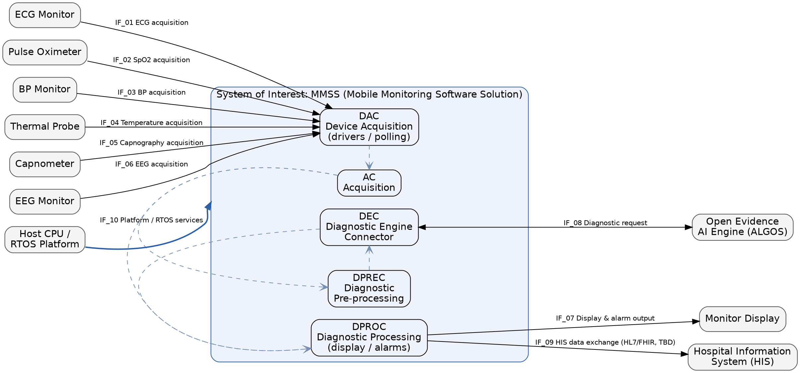
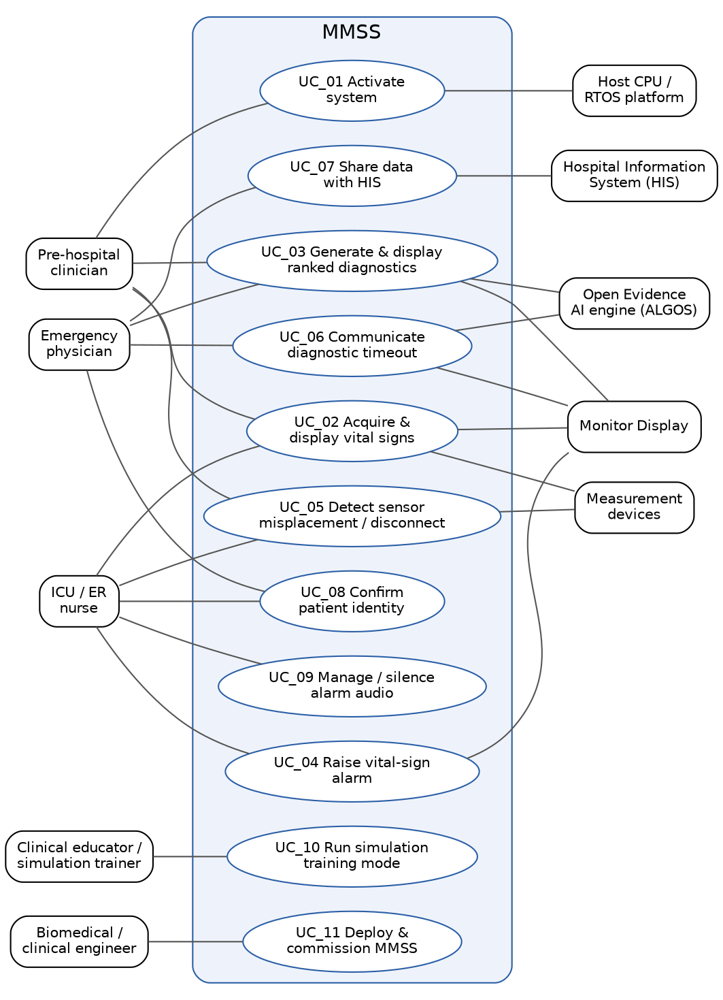
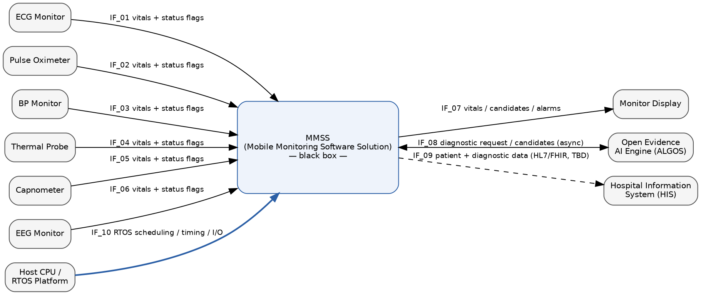

# Expectationeering Workbook

**Product**: Mobile Monitoring Software Solution (MMSS)
**Date**: 2026-06-09
**Workshop Team**: User Stakeholder, Customer Stakeholder, Business Stakeholder, Regulatory Stakeholder, Product Owner, System Architect, Usability Validation, Development Lead, Verification Lead, Quality Assurance

---

# Introduction

This workbook captures the expectations and requirements for the product, from informal stakeholder expectations through to verifiable system requirements. Every requirement item has a unique identifier, starting with the stakeholder expectations, and each item traces to the upstream item it is derived from.

## Intended users of the document

This workbook is intended for everyone involved in defining, building, verifying, and approving the MMSS software product:

- **Product Owner and project management** — to consolidate stakeholder needs, frame scope, set priorities, and govern release readiness.
- **Development team (System Architect, Development Lead, software engineers)** — to derive the system decomposition, interfaces, and an implementable design from the requirements.
- **Verification and Quality Assurance** — to plan and execute verification, build the coverage matrix, and review evidence against the requirements.
- **Regulatory Affairs and Quality Management** — to demonstrate IEC 62304 lifecycle rigour, ISO 14971 risk management, and conformity for market access.
- **Business, customer, user, and regulatory stakeholders** — to confirm that the captured expectations, scope boundary, and requirements reflect their intent before downstream design proceeds.

## Scope of the document

This workbook covers the **Mobile Monitoring Software Solution (MMSS)** — a software-only medical device product that turns an existing portable patient monitor from a passive vital-signs display into an active, AI-driven clinical decision-support tool, compliant with IEC 62304.

In scope:

- The complete MMSS application software stack — all five software items: Acquisition (AC), Device Acquisition (DAC), Diagnostic Engine Connector (DEC), Diagnostic Pre-processing (DPREC), and Diagnostic Processing (DPROC).
- Drivers and polling logic for the six measurement device interfaces: ECG monitor, pulse oximeter, blood-pressure monitor, thermal probe, capnometer, and EEG monitor.
- Acquisition, display, and alarm presentation of vital signs, including connection and sensor-misplacement alarms.
- AI diagnostic support through the externally sourced, commercially validated Open Evidence AI library, used as an off-the-shelf component, and rendering of ranked diagnostic candidates.
- Hospital Information System (HIS) integration for sharing patient and diagnostic data for a second opinion (HL7/FHIR).

Out of scope:

- All hardware: the host CPU platform, the six measurement devices, the monitor display, and the physical enclosure are existing, fixed elements accessed only through published interface control documents.
- Hardware design, selection, or modification; physical enclosure, portability, weight, and battery design.
- Development of a custom AI model (the validated Open Evidence model is mandated for the first release).

---

# Application

## Stakeholders (INFORMAL)

The stakeholder level is the start of the requirement approach. It captures the problem to be solved and the expectations of each stakeholder in a product-agnostic ("product-free") way.

### Problem

#### Domain Description

The domain is **mobile and critical-care patient monitoring with clinical decision support**. Trained medical professionals — paramedics, emergency physicians, ICU and ER nurses — attend critically ill patients in time-pressured, often uncontrolled environments such as ambulances, mobile medical units, emergency rooms, and intensive care units. They depend on portable, non-invasive monitors that acquire vital signs from a fleet of measurement devices (ECG, pulse oximetry, blood pressure, temperature, capnography, EEG) and present them in real time so that rapid treatment decisions can be made at the patient's side. Products in this domain — both this product and its competitors — must clear regulatory market-access barriers, conform to medical-device safety and alarm standards, integrate with existing device fleets and hospital information systems, and increasingly provide automated diagnostic assistance to help clinicians converge on a working diagnosis faster.

#### Actual State

Current portable critical-care monitors reliably acquire and display vital signs from non-invasive measurement devices in real time.

Pros:

- Continuous, real-time acquisition and display of vital signs from an established fleet of non-invasive devices.
- Familiar to trained clinicians; integrates with existing equipment and workflows.
- Mature, cleared, and standards-conformant for the monitoring function (alarms, safety classification).

Cons:

- Monitors are **passive**: they display raw vital signs but offer no interpretation or diagnostic support, leaving the full cognitive load of diagnosis on the clinician under extreme time pressure.
- No ranked diagnostic candidates, no confidence or basis for any suggestion, and no convergence toward a predictive diagnosis.
- Sensor misplacement, disconnection, and unreliable readings are not always unambiguously detected, risking decisions on incorrect or missing data.
- Diagnostic reasoning and handover to the receiving hospital are manual, slowing continuity of care and any second opinion.

#### Desired State

A monitoring solution that retains all the strengths of today's monitors **and adds** active, AI-driven diagnostic decision support.

Pros (the actual-state pros are kept):

- Continuous, real-time, low-latency acquisition and display of vital signs from the existing six-device fleet (retained).
- Familiar to trained clinicians and integrates with existing equipment and workflows (retained).
- Cleared, standards-conformant monitoring, alarms, and safety classification (retained).
- **New:** ranked, real-time diagnostic candidates presented alongside raw vital signs, converging toward a predictive diagnosis within the diagnostic budget, sourced from a commercially validated AI engine.
- **New:** transparent diagnostic output — basis, confidence, and known limitations — so clinicians apply their own judgement and do not over-trust automation.
- **New:** unambiguous, prioritised alarms for critical conditions, sensor misplacement, disconnection, and diagnostic-timeout, conforming to alarm-system standards.
- **New:** standards-based sharing of patient and diagnostic data with hospital information systems (HL7/FHIR) for continuity of care and a timely second opinion.

Cons:

- Added software complexity and a new diagnostic function raise the software safety class (Class C, mitigated to B) and the regulatory, validation, and liability burden.
- Reliance on a third-party AI component introduces external dependency, contractual, and version-management obligations.
- Greater risk of clinician over-reliance on automated suggestions and of alarm fatigue if not carefully designed and trained for.

#### Identified Gaps (DC_*)

The design changes needed to move from the actual state to the desired state.

| ID | Description |
|----|-------------|
| DC_01 | Add real-time, AI-driven diagnostic support that produces ranked diagnostic candidates from acquired data and converges toward a predictive diagnosis within the defined time budget, sourced from a commercially validated off-the-shelf engine. |
| DC_02 | Present diagnostic output transparently — its basis, confidence, and known limitations — so clinicians can apply their own judgement and avoid over-reliance, and notify the clinician promptly when diagnostic support cannot be produced in time. |
| DC_03 | Preserve continuous, low-latency, real-time acquisition and display of vital signs from the existing six-device measurement fleet, with rapid system activation. |
| DC_04 | Add unambiguous, prioritised alarming that distinguishes critical from minor conditions and reliably detects and signals sensor misplacement, disconnection, and unreliable readings, conforming to the applicable alarm-system standard. |
| DC_05 | Add standards-based interoperability so patient and diagnostic data can be exchanged with hospital information systems (HL7/FHIR) for continuity of care and a second opinion, while protecting data security and patient privacy. |
| DC_06 | Establish full medical-device lifecycle assurance for the new software — IEC 62304 design control, ISO 14971 risk management with safety mitigations reducing the class from C to B, third-party-component qualification, usability engineering, post-market surveillance, labelling, and competency-based training. |
| DC_07 | Confine the undertaking to a single, clearly bounded software discipline that integrates with fixed hardware through published interfaces, and that is deliverable, serviceable, and viable within the manufacturer's capacity, cost, margin, and strategic-portfolio limits. |

### Expectations

Stakeholder expectations are written "product-free": they apply to any product in the problem domain, including competitors. Format: *The \<stakeholder\> wants \<expectation\> to \<benefit driver\>.*

#### User Expectations (UE_*)

**Stakeholder**: Clinician (pre-hospital / critical-care)

Trained medical professionals — paramedics, emergency physicians, ICU and ER nurses — who attend critically ill patients in time-pressured, often uncontrolled environments such as ambulances, mobile medical units, emergency rooms, and intensive care units. They work hands-on at the patient's side, frequently while moving, interrupted, and managing several urgent tasks at once, and must make rapid treatment decisions from the patient's vital signs and clinical condition.

| ID | Expectation | Traces |
|----|-------------|--------|
| UE_01 | The Clinician wants the patient's vital signs to be tracked continuously and shown without perceptible delay to make rapid, safe treatment decisions at the bedside. | DC_03 |
| UE_02 | The Clinician wants early, structured diagnostic support alongside the raw vital signs to reach a working diagnosis faster when minutes matter. | DC_01 |
| UE_03 | The Clinician wants to understand the basis and confidence of any diagnostic suggestion to apply their own clinical judgement and avoid over-trusting an automated output. | DC_02 |
| UE_04 | The Clinician wants to be unambiguously alerted when a sensor is misplaced, disconnected, or producing unreliable readings to avoid acting on incorrect or missing patient data. | DC_04 |
| UE_05 | The Clinician wants alarms to clearly distinguish genuinely critical conditions from minor or transient ones to respond decisively without being desensitised by alarm fatigue. | DC_04 |
| UE_06 | The Clinician wants to be told promptly when diagnostic support cannot be produced in the expected time to fall back on standard clinical assessment without delaying treatment. | DC_02 |
| UE_07 | The Clinician wants to operate the monitor confidently in a moving, noisy, low-light, or chaotic setting to stay focused on the patient rather than on the device. | DC_06 |
| UE_08 | The Clinician wants to become competent and stay confident through realistic hands-on practice to use the monitor correctly under real emergency pressure. | DC_06 |
| UE_09 | The Clinician wants relevant patient data and diagnostic findings to be sharable with the receiving hospital to ensure continuity of care and a timely second opinion during handover. | DC_05 |
| UE_10 | The Clinician wants the monitor to be ready for use within seconds of being switched on and connected to begin monitoring an unstable patient without losing critical time. | DC_03 |

#### Market Expectations (ME_*)

**Stakeholder**: Hospital / EMS Procurement

The buying organisation — hospital procurement and biomedical engineering departments, emergency medical services, ambulance operators, and health-system purchasing groups — that funds, selects, and contracts for critical-care monitoring solutions on behalf of its clinical staff. It evaluates products against total cost of ownership, regulatory clearance and market-access status, fit with the existing fleet of monitors and sensors, integration with hospital information systems, training and rollout effort, vendor service and support, and the manufacturer's liability and risk posture. It must justify any purchase commercially and clinically, satisfy internal procurement and compliance rules, and avoid solutions that lock it in, disrupt established workflows, or fail to clear regulatory and security review.

| ID | Expectation | Traces |
|----|-------------|--------|
| ME_01 | The Hospital / EMS Procurement wants any monitoring solution to arrive with completed regulatory clearance and an IEC 62304-compliant safety file to gain market access and place the product into clinical use without further approval burden. | DC_06 |
| ME_02 | The Hospital / EMS Procurement wants a clearly justified total cost of ownership across licensing, deployment, training, and ongoing service to secure internal budget approval and avoid unforeseen lifecycle costs. | DC_07 |
| ME_03 | The Hospital / EMS Procurement wants the solution to integrate with the existing fleet of monitors and the established set of non-invasive measurement devices to protect prior capital investment and avoid wholesale equipment replacement. | DC_03, DC_07 |
| ME_04 | The Hospital / EMS Procurement wants the solution to exchange patient and diagnostic data with hospital information systems over standard interoperability protocols such as HL7 and FHIR to preserve continuity of care and avoid bespoke integration projects. | DC_05 |
| ME_05 | The Hospital / EMS Procurement wants the training and onboarding burden for clinical staff to be low and well supported to roll the solution out quickly without disrupting frontline care. | DC_06 |
| ME_06 | The Hospital / EMS Procurement wants dependable vendor service, support, and software maintenance commitments to keep the solution safe and operational throughout its deployed life. | DC_06, DC_07 |
| ME_07 | The Hospital / EMS Procurement wants the manufacturer to carry clear product liability and a documented risk-management posture to limit the buying organisation's clinical and legal exposure. | DC_06 |
| ME_08 | The Hospital / EMS Procurement wants the solution to meet the baseline capabilities clinicians already expect of any credible critical-care monitor to ensure clinical acceptance and competitive parity at the point of selection. | DC_03, DC_04 |
| ME_09 | The Hospital / EMS Procurement wants the solution to satisfy data security and patient-privacy requirements to pass internal information-security review and meet data-protection obligations. | DC_05 |
| ME_10 | The Hospital / EMS Procurement wants to avoid proprietary lock-in to a single vendor's devices or data formats to retain future purchasing leverage and freedom to evolve the monitoring fleet. | DC_05 |

#### Business Expectations (BE_*)

**Stakeholder**: Legal Manufacturer

The organisation that designs, produces, and places the medical device software on the market and carries full regulatory and product-liability responsibility for it. It speaks with one voice across its departments: Executive and Strategy (portfolio fit and risk appetite), Legal and Compliance (liability, intellectual property, post-market obligations), Finance (cost targets, margin, business-case viability), Operations and Manufacturing (software build, release, and supply feasibility at scale), R&D (technical feasibility and design freeze), Quality Management (QMS and design control under IEC 62304), Regulatory Affairs (declaration of conformity, technical file, market access), Sales and Commercial (pricing and customer commitments), Customer Support and Service (serviceability, maintainability, complaint handling), and Human Resources (workforce competency). It will only commit to what it can produce, support, and stand behind within its budget, capacity, competency, and acceptable-liability limits.

| ID | Expectation | Traces |
|----|-------------|--------|
| BE_01 | The Legal Manufacturer wants every design decision, risk control, and verification result to be documented under a compliant quality management system and design-control process to satisfy IEC 62304 obligations and withstand external audit and post-market scrutiny. | DC_06 |
| BE_02 | The Legal Manufacturer wants the diagnostic and alarming functions to be safety-mitigated so that residual risk is reduced to an acceptable, defensible level to limit its product-liability exposure as the party legally responsible for the device. | DC_06 |
| BE_03 | The Legal Manufacturer wants to build on a commercially validated off-the-shelf component for the most safety- and clearance-critical capability to transfer validation and regulatory-clearance risk away from the organisation and avoid the cost and delay of qualifying a bespoke equivalent. | DC_01, DC_06 |
| BE_04 | The Legal Manufacturer wants the contractual obligations, validation evidence, and update commitments of any externally sourced critical component to be clearly defined and binding to bound its own liability where it relies on a third party's output. | DC_06 |
| BE_05 | The Legal Manufacturer wants the scope of the undertaking to stay within a single, clearly bounded discipline rather than spilling into adjacent domains to protect feasibility, cost, and schedule and keep design and verification responsibility manageable. | DC_07 |
| BE_06 | The Legal Manufacturer wants the offering to be deliverable, releasable, and serviceable at the required quality and scale within its existing capacity and competency to ensure it can manufacture, maintain, and support the product throughout its lifecycle. | DC_07 |
| BE_07 | The Legal Manufacturer wants the product to meet its cost, margin, and investment targets to confirm a viable business case and justify the commitment of organisational resources. | DC_07 |
| BE_08 | The Legal Manufacturer wants a post-market surveillance and complaint-handling capability in place to meet its ongoing regulatory obligations and detect and correct field issues before they escalate into liability. | DC_06 |
| BE_09 | The Legal Manufacturer wants residual safety responsibility for time-critical or failure-prone functions to rest on independent mitigations rather than on a single point of failure to avoid retaining unacceptable liability for foreseeable misuse or component failure. | DC_04, DC_06 |
| BE_10 | The Legal Manufacturer wants the offering to align with its strategic portfolio direction and innovation roadmap to ensure the investment strengthens rather than fragments the organisation's market position. | DC_07 |

#### Regulatory Expectations (RE_*)

**Stakeholder**: Competent Authority / Notified Body

The regulatory system that decides whether a medical device may lawfully be placed on a market and remain there. It speaks for national competent authorities and surveillance agencies (e.g. FDA, EMA national authorities, TGA, PMDA, Swissmedic, CDSCO) that enforce market-access legislation and can approve, refuse, or withdraw a product; notified bodies that audit technical documentation and certify conformity (e.g. CE marking under the EU MDR); standards organisations (IEC, ISO, CEN) whose published standards define the presumption of conformity; and post-market vigilance and customs/border authorities that monitor devices in the field and at import. It does not advocate for any product; it holds every device in the domain — including competitors — to account against applicable law, harmonised standards, and enforcement practice, and grants access only when mandatory safety, performance, clinical, quality, and documentation obligations are demonstrably met.

| ID | Expectation | Traces |
|----|-------------|--------|
| RE_01 | The Competent Authority / Notified Body wants any diagnostic-support medical device software to be classified according to its safety impact and developed, maintained, and documented across the full software lifecycle under a recognised process such as IEC 62304 to ensure that lifecycle rigour is matched to the patient harm a software failure could cause. | DC_06 |
| RE_02 | The Competent Authority / Notified Body wants a documented risk-management process conforming to ISO 14971 that identifies hazards, estimates and controls risks, and demonstrates that residual risk — including any risk-control measures relied upon to reduce the software safety class — is acceptable to ensure that claimed mitigations are evidenced and not merely asserted. | DC_06 |
| RE_03 | The Competent Authority / Notified Body wants usability engineering conforming to IEC 62366-1 that demonstrates safe use by the intended users in the intended environment and controls reasonably foreseeable use error to ensure that the human-machine interaction does not itself become a source of patient harm. | DC_06 |
| RE_04 | The Competent Authority / Notified Body wants objective clinical evidence that any AI-driven diagnostic-support function performs as intended across its claimed indications and patient population, with defined performance metrics, validation data, and known limitations to ensure that diagnostic claims are scientifically substantiated before market access is granted. | DC_01, DC_02 |
| RE_05 | The Competent Authority / Notified Body wants any off-the-shelf or third-party software component used in a safety-related function to be identified, qualified, version-controlled, and supported by evidence of its validation and ongoing maintenance to ensure that responsibility and traceability are unbroken even where the manufacturer relies on a component it did not develop. | DC_01, DC_06 |
| RE_06 | The Competent Authority / Notified Body wants clinical alarm systems to conform to the applicable alarm-system standard such as IEC 60601-1-8, with defined alarm priorities, signals, and fault detection to ensure that critical conditions and equipment faults are communicated unambiguously and cannot be silently lost. | DC_04 |
| RE_07 | The Competent Authority / Notified Body wants the device to meet cybersecurity and data-protection obligations, securing patient data in storage and transit and protecting clinical function against compromise to ensure confidentiality, integrity, and availability of safety-relevant data and continued safe operation. | DC_05 |
| RE_08 | The Competent Authority / Notified Body wants any exchange of patient or diagnostic data with external information systems to use recognised interoperability standards such as HL7 or FHIR with defined interface specifications to ensure that data is transferred without loss, corruption, or misinterpretation across system boundaries. | DC_05 |
| RE_09 | The Competent Authority / Notified Body wants the device to carry labelling, instructions for use, and competency-based training provisions that convey intended use, limitations, warnings, and the meaning of automated diagnostic output to ensure that trained users operate the device safely and do not over-rely on its suggestions. | DC_02, DC_06 |
| RE_10 | The Competent Authority / Notified Body wants the manufacturer to maintain a post-market surveillance and vigilance system that monitors field performance, reports serious incidents, and triggers corrective and field-safety actions to ensure that safety obligations continue after market access and that emerging risks are detected and corrected. | DC_06 |

### Ideal Product Model (KA_*)

The Ideal Product Model is the blueprint that aligns stakeholder expectations with product capabilities — the key proposition attributes, their priority, feasibility, and risk.

| ID | Benefit Driver | Expectation | Proposition Attributes | Superior to | Priority | Feasible | Risk | Rationale |
|----|----------------|-------------|------------------------|-------------|----------|----------|------|-----------|
| KA_01 | Faster path to a working diagnosis | UE_02, ME_08, BE_03, RE_04 | MMSS diagnostic pipeline (DPREC pre-processing ≤800 ms, DPROC post-processing ≤200 ms, DEC connector ≤800 ms) that conditions acquired vital signs, invokes the off-the-shelf Open Evidence model, and renders ranked candidates within ≤1 s of receipt; predictive convergence within the 2-min ALGOS budget is owned by the external engine, not by MMSS | Today's passive monitors offer no interpretation — only raw vital signs — leaving the full diagnostic cognitive load on the clinician | High | Conditional — depends on Open Evidence delivering structured candidates and clearing regulatory validation; the 2-min convergence is an ALGOS budget MMSS cannot guarantee, MMSS only owns the ≤800/≤200 ms pre/post-processing budgets. Business condition: the manufacturer can only stand behind the diagnostic claim to the extent the supplier's validation evidence and clearance status are contractually transferable (BE_04) | R_01 (clearance delays gate first revenue), R_02 (model validation complexity), R_03 (real-time integration to external engine); **liability** — the legal manufacturer carries device-level responsibility for a diagnostic claim built on a component it did not develop, so any gap in the supplier's clearance/validation evidence becomes the manufacturer's regulatory and product-liability exposure | The defining differentiator that turns a passive monitor into an active decision-support tool; off-the-shelf model mandated to bound validation risk and transfer clearance risk, but the manufacturer retains residual responsibility for the integrated device |
| KA_02 | Trust calibrated to the evidence | UE_03, RE_04, RE_09 | Transparent diagnostic presentation — basis, confidence/ranking, and known limitations rendered by DPROC alongside each candidate within the ≤1 s display budget so the clinician applies their own judgement | Competitors that surface AI output without confidence or basis invite over-trust; passive monitors offer nothing to calibrate against | High | Conditional — rendering is within MMSS UI scope, but the basis/confidence/limitations content must be supplied in the Open Evidence structured output; MMSS cannot synthesise data the off-the-shelf model does not emit. Business condition: the supplier contract (BE_04) must guarantee delivery and stability of confidence/basis/limitations fields, since the manufacturer cannot make a transparency claim it cannot source | R_05 (clinician misinterpretation of AI candidates); R_03 (incomplete structured output from external engine); **liability** — this is the primary control against the over-reliance hazard; if the manufacturer markets diagnostic output without defensible, labelled confidence/limitations it carries direct liability for foreseeable misinterpretation (R_05 is Critical), making this transparency the manufacturer's chief liability shield, not a cosmetic feature | Mitigates over-reliance on automation and is required for safe-use and clinical-evidence clearance; load-bearing for the manufacturer's defensible-residual-risk argument (BE_02) |
| KA_03 | No silent diagnostic gap | UE_06, BE_09, RE_09 | MMSS detects absence of a candidate within the 2-minute ALGOS window and shows an explicit on-screen timeout notification, backed by the independent ALGOS audible timeout signal, so the clinician falls back to standard assessment | Passive monitors have no diagnostic function to fail; a non-transparent AID could leave the clinician waiting indefinitely | High | Yes — visual timeout detection/notification is MMSS logic; the independent audible path is an ALGOS-side mitigation already assumed, keeping the safety control off the single MMSS path | R_06 (timeout not communicated → treatment delay) | Removes a critical-severity failure path; the independent audible mitigation keeps residual MMSS risk acceptable per BE_09 |
| KA_04 | Decisions on trustworthy data | UE_01, UE_10, ME_03, ME_08 | Continuous low-latency acquisition (AC/DAC drivers and polling, ≥0.1 Hz input) and display of vital signs from the six fixed device interfaces (ECG, pulse oximeter, BP, thermal probe, capnometer, EEG), system ready <10 s and vital-signs display <1 s after acquisition on a 1-s UI update timer | Matches the proven strength of incumbent monitors while integrating with the customer's installed device fleet | High | Conditional — display logic is within MMSS scope, but real-time integration to all six fixed device interfaces depends on the published ICDs being defined and the host RTOS meeting the timing budgets | R_03 (real-time integration / connectivity) | Preserves the actual-state strength clinicians and buyers already rely on; competitive parity baseline (R_08 portability is hardware-side and out of MMSS scope) |
| KA_05 | Warned before acting on missing or wrong data | UE_04, UE_05, ME_08, RE_06, BE_09 | Unambiguous, prioritised MMSS alarm presentation conforming to IEC 60601-1-8 that distinguishes critical from minor conditions; raises a connection alarm after 5 s of inactivity (displayed <1 s after trigger) and surfaces device-reported misplacement and unreliable-reading flags | Incumbent monitors do not always unambiguously detect misplacement/disconnection and can drive alarm fatigue | High | Conditional — alarm logic and connection-loss timing are within MMSS scope, but misplacement auto-detection is a device-side function (out of software scope); MMSS can only present what the six fixed devices report, so the safety claim depends on the devices emitting misplacement flags | R_04 (misplacement → wrong diagnosis — detection is device-side per mitigation), R_07 (connection failure → missed vitals — independent device audible alarm backs the MMSS connection alarm); **liability** — because misplacement detection is device-side and out of software scope, the manufacturer must label this boundary explicitly and confirm in the ICDs that the fixed devices actually emit misplacement flags; if MMSS presents an alarm the devices cannot reliably trigger, the manufacturer carries liability for a safety claim it cannot fulfil | Directly mitigates two critical-severity hazards and is a regulatory alarm-standard obligation; device-side detection and independent audible alarms keep the safety control off the single MMSS path. Priority High confirmed — safety-critical and a hard regulatory (IEC 60601-1-8) gate |
| KA_06 | Continuity of care across the handover | UE_09, ME_04, ME_09, ME_10, RE_07, RE_08 | Standards-based HIS interoperability (HL7/FHIR) that shares patient and diagnostic data securely (encryption in transit) for a timely second opinion, sending candidates to the HIS within <1 s, avoiding bespoke integration and vendor lock-in | Manual handover and proprietary formats slow continuity of care and lock buyers in | Medium | Conditional — HIS protocol (HL7 vs FHIR) and the interface ICDs are still TBD per the project assumptions; feasibility and the security claim cannot be confirmed until the ICD is defined. Business condition: with two protocols and undefined ICDs, the manufacturer should fix one protocol at design freeze rather than commit to both, to avoid open-ended integration cost and per-customer bespoke work the business case cannot absorb | R_03 (integration challenges — undefined external interface); **liability/contractual** — exporting patient and diagnostic data engages data-protection and cybersecurity obligations (RE_07), so any breach or data-corruption-across-boundary becomes manufacturer liability; an undefined ICD also risks unbounded per-customer integration commitments that erode margin | Enables continuity and second opinion and removes a procurement lock-in objection; **Priority Medium confirmed** — valuable but not safety-critical and ICD-gated, so it must not be prioritised over the safety-critical KA_03/KA_05; gated on ICD definition and single-protocol design freeze |
| KA_07 | Defensible market access | ME_01, ME_07, BE_01, BE_02, RE_01, RE_02 | Full IEC 62304 design control with ISO 14971 risk management and safety mitigations reducing the software class from C to B, yielding a complete, auditable safety file | Buyers must otherwise carry approval burden and liability; a non-compliant offering cannot enter clinical use | High | Yes — within established manufacturer QMS competency and design-control capacity; the C→B mitigation depends on the independent alarm/timeout controls in KA_03 and KA_05 actually being independent of MMSS, so the safety-file claim is only defensible if those mitigations hold | R_01 (regulatory clearance delays); **liability** — this safety file is the manufacturer's primary legal defence as the party that places the device on the market and signs the declaration of conformity; an incomplete or unauditable file is not just a launch delay but direct regulatory and post-market liability exposure (ties to BE_01, BE_08) | Without an evidenced, class-mitigated safety file the product cannot be lawfully placed on the market; foundational and correctly High priority |
| KA_08 | Bounded third-party liability | BE_03, BE_04, RE_05 | Qualified, version-controlled use of the Open Evidence component with binding contractual validation, update, and support commitments and unbroken traceability | A bespoke model would carry full in-house validation cost and risk; an unqualified component breaks traceability | High | Conditional — depends on an enforceable Open Evidence supplier agreement covering validation evidence, version control, change notification, and end-of-support commitments; without it the manufacturer cannot qualify the component to RE_05 nor maintain it post-market (BE_08) | R_01, R_02; **contractual/liability** — the entire diagnostic value proposition (KA_01, KA_02) rests on this single third-party component, so a weak or lapsing supplier agreement, an uncontrolled model update, or supplier end-of-life directly threatens clearance, traceability, and the manufacturer's ability to stand behind the device; this is concentrated single-supplier dependency risk | Transfers validation/clearance risk while keeping regulatory responsibility and traceability intact; **Priority raised Medium→High** — this contractual control gates the safety- and revenue-critical KA_01/KA_02, so it is liability-critical rather than secondary and must not be under-prioritised |
| KA_09 | Eyes-on-patient operation under pressure | UE_07, UE_08, ME_05, RE_03, RE_09 | Usability engineering to IEC 62366-1 that minimises interaction demand and supports glanceable, low-error operation in moving, noisy, low-light environments, plus a built-in MMSS simulation training mode and competency-based onboarding so clinicians stay focused on the patient rather than the device | Competitors relying on classroom-only training leave use-error risk unmitigated and raise rollout burden | High | Yes — simulation mode and UX are within MMSS software scope and manufacturer competency; sustaining training content and competency records adds an ongoing support/HR commitment the business must staff for | R_05 (foreseeable use error, incl. misinterpretation of AI candidates) is the named mitigation in the risk register for the Critical-severity R_05 hazard; **liability** — IEC 62366-1 usability engineering and competency-based training are how the manufacturer discharges its duty against foreseeable use error and limits its over-reliance liability (with KA_02), so this is a safety mitigation the safety file depends on, not a commercial nicety | Controls foreseeable use error, is a usability-standard obligation, and lowers the buyer's onboarding cost; the low-interaction, glanceable design is what lets the clinician keep their attention on the patient under stress (UE_07), not just be trained for it (UE_08); **Priority raised Medium→High** — it is the register-named mitigation for a Critical hazard and a regulatory (IEC 62366-1) gate, so it cannot rank below ICD-gated convenience features |
| KA_10 | A viable, supportable product | ME_02, ME_06, BE_05, BE_06, BE_07, BE_10, RE_10 | Software-only scope bounded to the five SW items (AC, DAC, DEC, DPREC, DPROC) integrating with fixed hardware via published ICDs, deliverable within manufacturer capacity, with post-market surveillance and a justified total cost of ownership | An over-scoped offering risks cost, schedule, and serviceability; competitors without PMS expose buyers to unaddressed field risk | High | Yes — the explicit software-only scope boundary holds the undertaking to one discipline within manufacturer capacity and competency; the ongoing cost of post-market surveillance, software maintenance, and third-party-component change management (KA_08) must be funded in the business case (BE_07), not just at launch | R_03 (scope creep into external-interface integration if ICDs slip); **organisational/liability** — PMS and complaint handling are a standing regulatory obligation (RE_10, BE_08), so under-resourcing post-market capacity is itself a liability and audit-finding risk; serviceability of a device dependent on an external AI component also commits the manufacturer to lifecycle support it must staff and fund | Protects feasibility, business-case viability, and lifecycle support, and keeps the undertaking within one discipline (R_08 portability is hardware-side and outside this software scope); Priority High confirmed — it is the scope/viability and post-market obligation that underwrites the whole programme |

### Business 'Requirements' (BR_*)

Conceptual project inputs from all business stakeholders that apply across the whole product lifecycle (development, launch, manufacturing, deployment, operation & use, end of life).

| ID | Description | Rationale | Stakeholder | Importance | Traces |
|----|-------------|-----------|-------------|------------|--------|
| BR_01 | The first release (v1.0) shall use the commercially available, validated Open Evidence AI model as a mandated off-the-shelf component, integrated only through MMSS's DEC connector against the model's published structured-output interface; no custom or in-house diagnostic model shall be developed. | Transfers diagnostic validation and regulatory-clearance risk to a cleared third-party component and avoids the cost, schedule, and liability of qualifying a bespoke equivalent for v1.0; an explicit project constraint. Architecturally feasible only as an integration boundary, not a model-development task: MMSS owns the DEC connector contract (request format, structured-candidate parsing, error/timeout handling) but treats the model as a black box, so the design depends on Open Evidence exposing a stable, versioned API and structured candidate fields — if those are absent the off-the-shelf strategy is not implementable. | R&D / Executive & Strategy | High | KA_01, KA_08, BE_03 |
| BR_02 | The MMSS software shall be developed, documented, and maintained across its full lifecycle in conformity with ANSI/AAMI IEC 62304, with the software safety classification established as Class C and mitigated to Class B. | A non-conformant offering cannot lawfully enter clinical use; lifecycle rigour must match the patient harm a software failure could cause, and the C→B mitigation underpins the defensible safety file; a mandated project constraint. | Quality Management / Regulatory Affairs | High | KA_07, BE_01, BE_02 |
| BR_03 | Risk management shall be conducted in conformity with ISO 14971 throughout the lifecycle, demonstrating that all residual risks — including any risk controls relied upon to reduce the software class from C to B — are reduced to an acceptable, defensible level. | The class-mitigation claim is only defensible if the independent alarm and diagnostic-timeout controls are evidenced rather than asserted, bounding the manufacturer's product-liability exposure. | Quality Management / Legal & Compliance | High | KA_07, KA_03, KA_05 |
| BR_04 | The software shall support acquisition from exactly the six mandated non-invasive device types — ECG monitor, pulse oximeter, blood-pressure monitor, thermal probe, capnometer, and EEG monitor — through their published, defined-and-frozen interface control documents, including the device-reported connection-loss, misplacement, and unreliable-reading flags MMSS presents. | Protects the customer's installed device-fleet investment and defines the fixed integration boundary; an explicit project constraint and competitive-parity baseline. Architecturally, "supported" means one acquisition driver and polling path per interface within the AC/DAC items; this is implementable only against ICDs that are defined and stable at design freeze, and the dependent alarm/misplacement claims (KA_05) hold only if the six ICDs confirm the devices actually emit those status flags — an unspecified or changing ICD makes the corresponding driver and safety presentation unverifiable. | R&D / Operations | High | KA_04, ME_03, ME_08 |
| BR_05 | The undertaking shall be confined to software only — the five software items AC, DAC, DEC, DPREC, and DPROC — integrating with fixed hardware exclusively through published ICDs; no hardware design, selection, or modification shall be in scope. | Holds the programme to a single, bounded discipline within the manufacturer's capacity and competency, protecting feasibility, cost, and schedule; an explicit scope constraint. | Operations / R&D / Executive & Strategy | High | KA_10, BE_05, BE_06 |
| BR_06 | The 2-minute diagnosis-convergence target shall be owned by the external ALGOS/Open Evidence engine, not committed to as an MMSS budget; MMSS shall be bound only by its own display-latency budget of ≤1 s, decomposed across the software items as DPREC ≤800 ms (pre-processing) and DPROC ≤200 ms (post-processing/render), and shall explicitly exclude the DEC round-trip to the external engine from this display budget. | The manufacturer cannot stand behind a convergence claim it does not control; clarifying the budget boundary prevents an unfulfillable contractual commitment and bounds liability to what MMSS owns; an explicit project constraint. Architecturally the ≤1 s display budget is per-item and met on the RTOS host, but it is only feasible if the external-engine call (DEC, ≤800 ms) is treated as a separate, asynchronous round-trip and not folded into the synchronous display path — otherwise variable network/engine latency would silently break a budget MMSS is held to. The convergence and DEC budgets therefore sit on the supplier/interface side; only DPREC and DPROC are guaranteed by MMSS's own scheduling. | R&D / Legal & Compliance | High | KA_01, BE_04 |
| BR_07 | Any externally sourced critical component (Open Evidence) shall be qualified as SOUP under IEC 62304, version-controlled, and governed by a binding supplier agreement covering validation evidence, interface stability, change/version notification, update, and end-of-support commitments, with unbroken traceability maintained post-market. | The entire diagnostic value proposition rests on a single third-party component; an enforceable agreement is required to qualify the component, preserve traceability, and bound the manufacturer's liability where it relies on a supplier's output. Architecturally this is the SOUP-qualification obligation of IEC 62304 §5.3/§8: because MMSS integrates the model only through the DEC connector (BR_01), the supplier agreement must also pin the API/structured-output contract version, so that a silent model or interface change cannot break MMSS's parsing or invalidate its diagnostic claim without triggering change control. | Legal & Compliance / Quality Management | High | KA_08, BE_04 |
| BR_08 | The product shall meet the manufacturer's cost, margin, and investment targets and present a justified, itemised total cost of ownership to the buyer that separates one-off costs (licensing, deployment, integration, training) from recurring costs (software maintenance, support, AI-component subscription/renewal) across the deployed life. | Confirms a viable business case before resources are committed and, on the buyer side, is the decisive purchasing criterion: hospital/EMS procurement must justify the spend against an internal budget and cannot secure approval without a defensible, no-surprises TCO that exposes recurring AI-component and maintenance costs up front. An itemised TCO is also what lets the buyer compare against incumbent monitors at selection. | Finance / Sales & Commercial | High | KA_10, BE_07, ME_02 |
| BR_09 | The manufacturer shall establish and maintain a post-market surveillance, vigilance, and complaint-handling capability, together with contractually committed software-maintenance, security-patch, and supplier-change-management service levels (including response/resolution targets) throughout the product's deployed life. | Post-market surveillance is a standing regulatory obligation; on the buyer side, dependable, contractually committed vendor service and support is a primary procurement criterion — hospital/EMS buyers will not deploy a safety-critical, AI-dependent device without defined maintenance and security-patch service-level commitments, since under-supported software directly threatens continued safe operation and exposes the buyer to clinical and field risk. | Customer Support & Service / Regulatory Affairs | High | KA_10, BE_08, ME_06 |
| BR_10 | The product shall provide usability engineering to IEC 62366-1 and a built-in simulation training mode with competency-based onboarding, supported by labelling and instructions for use that convey intended use, limitations, and the meaning of automated diagnostic output. | Controls foreseeable use error and clinician over-reliance — the named mitigation for a Critical-severity hazard — discharging the manufacturer's safe-use duty while lowering the buyer's rollout and onboarding burden. | Quality Management / Human Resources / Customer Support & Service | High | KA_09, KA_02, ME_05 |
| BR_11 | HIS interoperability shall be delivered over a recognised open interoperability standard (HL7/FHIR), with a single protocol fixed at design freeze and the interface ICD defined and frozen before the DEC/HIS connector design is committed, and patient/diagnostic data secured in transit. | Using an open standard rather than a proprietary format removes the buyer's most common procurement objection — bespoke per-site integration cost and vendor lock-in — and protects the buyer's freedom to evolve its monitoring fleet (ME_10); for the manufacturer, fixing one protocol and defining the ICD avoids open-ended, per-customer integration commitments the business case cannot absorb. This is the one genuinely undefined external interface and the principal architectural risk in the design: an HL7-vs-FHIR choice and an undefined ICD are not implementable as a verifiable connector, so this BR is feasible only if the protocol selection and ICD precede design freeze. The data-sharing path is also non-safety-critical and must remain isolated from the acquisition/alarm path so HIS unavailability cannot degrade monitoring (consistent with the Medium priority). | Operations / Sales & Commercial / Legal & Compliance | Medium | KA_06, ME_04, ME_10 |
| BR_12 | The offering shall align with the manufacturer's strategic portfolio direction and innovation roadmap. | Ensures the investment strengthens rather than fragments the organisation's market position and justifies the commitment of organisational resources. | Executive & Strategy | Medium | KA_10, BE_10 |
| BR_13 | The product shall deploy onto the buyer's existing portable-monitor and six-device measurement fleet without requiring replacement of compatible installed hardware, and shall avoid proprietary lock-in to a single vendor's devices, sensors, or data formats by relying on the published device ICDs and open interoperability standards. | Fit with the installed fleet and freedom from vendor lock-in is a make-or-break purchasing criterion for hospital/EMS procurement: as a software-only solution MMSS's principal commercial advantage is that it upgrades existing monitors rather than forcing wholesale capital replacement, protecting prior investment and preserving the buyer's future purchasing leverage. A solution that mandated specific proprietary devices or locked data into a closed format would be rejected at selection regardless of clinical merit. | Sales & Commercial / Operations | High | KA_04, KA_06, ME_03, ME_10 |
| BR_14 | The product shall satisfy hospital/EMS information-security and data-protection requirements — protecting patient and diagnostic data in storage and transit, controlling access, and supporting the buyer's internal security and privacy review — and shall provide the documentation needed to evidence this at procurement. | Passing the buyer's internal information-security and data-protection review is a hard procurement gate: hospital/EMS purchasing cannot sign off on a connected, data-exporting medical device without evidence that it meets cybersecurity and patient-privacy obligations, so failing security review is a showstopper that blocks the sale irrespective of clinical or cost merit. Providing the supporting documentation up front shortens the procurement cycle and de-risks the sale. | Legal & Compliance / Quality Management / Sales & Commercial | High | KA_06, ME_09, RE_07 |

## Context (FORMAL)

The context level is the start of the solution domain (DHF), based on the problem domain and the stakeholder expectations.

### Intended Use (IU_01)

Write the intended use as a single, flowing prose statement that naturally covers the five aspects — what the product is, what it does (medical indication), who uses it (user profile), where it is used (use environment), and how it works (operating principle). Do **not** add bold labels or headers for the aspects; weave them into the sentences.

| ID | Description |
|----|-------------|
| IU_01 | The Mobile Monitoring Software Solution (MMSS) is medical device software that turns an existing portable patient monitor into an active clinical decision-support tool, intended to provide continuous, real-time monitoring of the vital signs of critically ill patients and to present AI-driven diagnostic support that assists — but does not replace — the clinician's own assessment, so that trained medical professionals such as paramedics, emergency physicians, and ICU and ER nurses can reach a working diagnosis and make rapid, safe treatment decisions at the patient's side, for use in intensive care units, emergency rooms, and mobile and pre-hospital medical units; it operates by acquiring data from a defined set of non-invasive measurement devices (ECG, pulse oximeter, blood-pressure monitor, thermal probe, capnometer, and EEG) through standardised interfaces, processing that data through the externally sourced, commercially validated Open Evidence AI engine, presenting raw vital signs together with ranked diagnostic candidates and their basis, confidence, and known limitations on the connected monitor display as decision support that the qualified user must interpret and act upon under their own clinical judgement and responsibility, generating prioritised, perceptible (audible and visual) clinical alarms for abnormal patient conditions and for sensor-misplacement and connection faults so that they are noticed even when the clinician's attention is on the patient rather than the display, and optionally sharing patient and diagnostic data with hospital information systems over standard interoperability protocols for continuity of care and a timely second opinion; the software does not by itself make, confirm, or override a diagnosis or treatment decision, and is not intended as a sole basis for clinical decision-making or as a substitute for the clinician's professional judgement. |

### Medical Device Classification (MD_01)

| ID | Description | Traces |
|----|-------------|--------|
| MD_01 | Under ANSI/AAMI IEC 62304, the MMSS software system is initially classified as Class C, because absent any external risk control a failure or latent flaw in its diagnostic-support, monitoring, or alarming functions could contribute to a hazardous situation resulting in death or serious injury of the patient. Applying the IEC 62304 §4.3 segregation principle, the classification is reduced to Class B by hardware-and-system-level risk-control measures, implemented and verified outside the MMSS software, that break every sequence of events leading to serious harm: the safety-critical connection-loss and sensor-misplacement alarming is provided independently by the measurement devices (device-generated audible alarms), and the diagnostic-timeout safety signal is provided independently by the ALGOS engine (independent audible notification on the 2-minute timeout). Because these external systems are independent of MMSS and are not by themselves dependent on correct MMSS operation, no single failure of the MMSS software can, by itself, result in unmitigated serious patient harm; the residual harm a software failure could still cause is non-serious, justifying Class B for the MMSS software items. This reduction holds only for as long as ISO 14971 risk-management evidence (BR_03) demonstrates the independence and effectiveness of those external mitigations; if that independence is not substantiated, the affected software items revert to Class C. The assessed software safety class is therefore Class B (initial Class C, mitigated to B). | IU_01 |

### Context Diagram

The context diagram identifies the system of interest in relation to its context. The system of interest contains all elements that are part of the design.

Author the diagram as Graphviz DOT in the fenced `dot` block below: put the System of Interest (and its system elements) in a central cluster, the context elements as surrounding nodes, and the external interfaces (IF_*) as labelled edges between them. The converter renders this block to an image and inserts it into the document.



#### Product Information

The **Mobile Monitoring Software Solution (MMSS)** is a software-only, IEC 62304-regulated medical device software product that runs on an existing portable patient monitor and transforms it from a passive vital-signs display into an active, AI-driven clinical decision-support tool. It delivers continuous, low-latency vital-signs monitoring together with ranked, real-time diagnostic candidates and prioritised clinical alarms, and optionally shares patient and diagnostic data with hospital information systems for continuity of care and a second opinion. It operates as a pipeline of five cooperating software items hosted on the monitor's embedded real-time platform: drivers and polling logic acquire data from six fixed non-invasive measurement devices through published interfaces (DAC, AC), the acquired data is conditioned and forwarded over a connector to the externally sourced, commercially validated Open Evidence AI engine (DPREC, DEC), and the returned diagnostic candidates — with their basis, confidence, and known limitations — are rendered alongside raw vital signs and alarms on the connected monitor display (DPROC). MMSS owns its ≤1 s display-latency budget (DPREC ≤800 ms, DPROC ≤200 ms); the 2-minute diagnosis-convergence target and the diagnostic round-trip are owned by the external engine, and the safety-critical connection-loss, sensor-misplacement, and diagnostic-timeout signals are backed by independent device- and engine-side alarms, which is what reduces the software safety class from C to B.

#### System of Interest

The part of the broader system this document is about — the product, subsystem, or component you are responsible for designing.

| System Element | Description |
|----------------|-------------|
| MMSS | The complete Mobile Monitoring Software Solution — the software stack under design, decomposed into the five software items below. It hosts the acquisition-to-presentation pipeline on the monitor's embedded RTOS platform and owns every interface to the surrounding context elements. |
| AC (Acquisition) | The acquisition-orchestration item: consolidates the polled device readings from DAC into a coherent, time-stamped vital-signs stream, manages the ≥0.1 Hz input rate and the 1 s UI update timing, detects connection loss (5 s inactivity), and feeds both the presentation path (DPROC) and the diagnostic path (DPREC). |
| DAC (Device Acquisition) | The device-driver and polling layer: one acquisition driver and polling path per measurement-device interface, reading vital signs and device-reported connection-loss, misplacement, and unreliable-reading flags from the six fixed devices through their published ICDs. |
| DEC (Diagnostic Engine Connector) | The connector to the external Open Evidence AI engine (ALGOS): formats the diagnostic request, performs the asynchronous round-trip (≤800 ms budget, excluded from the display budget), parses the returned structured diagnostic candidates, and handles engine error and 2-minute timeout conditions. |
| DPREC (Diagnostic Pre-processing) | The diagnostic pre-processing item: conditions and structures the acquired vital-signs data into the input expected by the AI engine, within a ≤800 ms budget, before it is dispatched through DEC. |
| DPROC (Diagnostic Processing) | The post-processing and presentation item: renders raw vital signs, ranked diagnostic candidates with their basis/confidence/limitations, and prioritised clinical and fault alarms on the monitor display within the ≤200 ms / ≤1 s display budget, and emits patient and diagnostic data to the HIS. |

#### Context Elements

Essential elements for your product that are not part of the design.

| Context Element | Description |
|-----------------|-------------|
| ECG Monitor | Existing, fixed non-invasive ECG measurement device. Supplies cardiac/heart-rate vital signs and device status flags to MMSS through its published ICD; its internal design is out of scope. |
| Pulse Oximeter | Existing, fixed non-invasive SpO2/pulse measurement device. Supplies oxygen-saturation and pulse vital signs and device status flags to MMSS through its published ICD. |
| BP Monitor | Existing, fixed non-invasive blood-pressure measurement device. Supplies blood-pressure vital signs and device status flags to MMSS through its published ICD. |
| Thermal Probe | Existing, fixed non-invasive temperature measurement device. Supplies body-temperature vital signs and device status flags to MMSS through its published ICD. |
| Capnometer | Existing, fixed non-invasive capnography (end-tidal CO2) measurement device. Supplies respiratory CO2 vital signs and device status flags to MMSS through its published ICD. |
| EEG Monitor | Existing, fixed non-invasive EEG measurement device. Supplies neurological/brain-activity vital signs and device status flags to MMSS through its published ICD. |
| Monitor Display | The existing portable monitor's display hardware on which MMSS renders raw vital signs, ranked diagnostic candidates, and prioritised visual/audible alarms. Physical display hardware is fixed and out of scope. |
| Host CPU / RTOS Platform | The compact embedded CPU with real-time-OS capabilities on which MMSS executes. Provides scheduling, timing, memory, and I/O services that MMSS relies on to meet its latency budgets. Hardware and OS are fixed and out of scope. |
| Open Evidence AI Engine (ALGOS) | The externally sourced, commercially validated off-the-shelf AI diagnostic engine, used as a black-box SOUP component. Receives conditioned data from MMSS and returns structured ranked diagnostic candidates; owns the 2-minute convergence budget and emits an independent audible timeout notification. |
| Hospital Information System (HIS) | The receiving hospital's information system. Exchanges patient and diagnostic data with MMSS over a standard interoperability protocol (HL7/FHIR) for continuity of care and a second opinion. External system; protocol and ICD still to be defined. |

#### External Interfaces (IF_*)

Connections between the system of interest and the context elements (mechanical, chemical, electronic, digital, logical, etc.).

| ID | Name | Port 1 | Port 2 | ICD |
|----|------|--------|--------|-----|
| IF_01 | ECG acquisition interface | ECG Monitor | MMSS:DAC | Defined (published device ICD) |
| IF_02 | Pulse-oximeter acquisition interface | Pulse Oximeter | MMSS:DAC | Defined (published device ICD) |
| IF_03 | Blood-pressure acquisition interface | BP Monitor | MMSS:DAC | Defined (published device ICD) |
| IF_04 | Temperature acquisition interface | Thermal Probe | MMSS:DAC | Defined (published device ICD) |
| IF_05 | Capnography acquisition interface | Capnometer | MMSS:DAC | Defined (published device ICD) |
| IF_06 | EEG acquisition interface | EEG Monitor | MMSS:DAC | Defined (published device ICD) |
| IF_07 | Display and alarm output interface | MMSS:DPROC | Monitor Display | Defined (host display ICD) |
| IF_08 | Diagnostic-engine interface | MMSS:DEC | Open Evidence AI Engine (ALGOS) | Defined (Open Evidence published structured-output API); bidirectional request/response |
| IF_09 | HIS data-exchange interface | MMSS:DPROC | Hospital Information System (HIS) | TBD (HL7/FHIR — protocol and ICD to be defined and frozen before connector design) |
| IF_10 | Host platform / RTOS services interface | Host CPU / RTOS Platform | MMSS (AC) | Defined (host RTOS API/runtime contract) |

## Users

### User Groups

Collections of users who share common characteristics (a synonym is User Role).

| User | User Group | User Profile |
|------|------------|--------------|
| Paramedic / EMS field clinician | Pre-hospital clinician | Trained, licensed emergency medical professional operating in ambulances and mobile medical units. Works hands-on at the patient's side, frequently while the vehicle is moving and in noisy, low-light, vibrating, time-pressured and uncontrolled environments. Often the sole or lead caregiver, managing multiple urgent tasks at once with gloved hands and divided attention; needs glanceable information and minimal device interaction. Competent with portable monitors but not a software or device specialist; relies on the device being ready in seconds and on unambiguous alarms. |
| Emergency physician | Hospital acute-care clinician | Highly trained, licensed physician working in the emergency room and resuscitation bays. Makes rapid differential-diagnosis and treatment decisions on unstable patients, often supervising a team and integrating monitoring data with clinical examination. High clinical-reasoning capability; values transparent diagnostic support (basis, confidence, limitations) to calibrate trust and apply independent judgement. Interrupt-driven, simultaneously managing several patients, limited time per patient. |
| ICU / ER nurse | Hospital critical-care nurse | Trained, licensed nurse providing continuous bedside monitoring and care of critically ill patients in intensive care and emergency settings. The most frequent and sustained user of the monitor — sets up devices, connects sensors, responds first to alarms, and manages connection and sensor-misplacement faults. Skilled with patient-monitoring equipment and alarm management; sensitive to alarm fatigue. Works long shifts, often managing several monitored patients, and performs handover to receiving units. |
| Clinical educator / simulation trainer | Training user | Clinical or nurse educator responsible for onboarding and maintaining the competency of clinical staff on the monitor. Uses the built-in simulation training mode to deliver realistic, hands-on practice and to assess competency without a live patient. Clinically experienced and familiar with the device's intended use, limitations, and the meaning of automated diagnostic output; needs a safe, non-clinical operating mode clearly distinguishable from live use. |
| Biomedical / clinical engineer | Technical support user | Hospital or EMS biomedical engineering staff responsible for deployment, configuration, integration (device fleet and HIS), commissioning, and ongoing service of the monitor. Technically trained, not a primary clinical decision-maker; needs the software to deploy onto the existing portable-monitor and six-device fleet through published ICDs, to interoperate with the HIS over HL7/FHIR, and to support information-security and maintenance obligations. |

### User Requirements / Needs (UR_*)

The user expectations translated over the product context into requirements specific to YOUR product. They are SMARTER than the expectations and form the base for product validation. Format: *As a \<user group\> I want \<feature\> so that \<benefit\>.*

| ID | Description | Classification | Traces |
|----|-------------|----------------|--------|
| UR_01 | As a pre-hospital clinician I want MMSS to continuously acquire and display the patient's vital signs from the six connected non-invasive devices with vital-signs shown within 1 second of acquisition on a 1-second update, so that I can make rapid, safe treatment decisions at the bedside on current data. | High | IU_01, KA_04, BR_04, UE_01 |
| UR_02 | As a pre-hospital clinician I want MMSS to be ready for monitoring within 10 seconds of being switched on and connected, so that I can begin monitoring an unstable patient without losing critical time. | High | IU_01, KA_04, BR_04, UE_10 |
| UR_03 | As an emergency physician I want MMSS to present early, ranked diagnostic candidates alongside the raw vital signs within 1 second of receiving them from the AI engine, so that I can reach a working diagnosis faster when minutes matter. | High | IU_01, KA_01, BR_01, UE_02 |
| UR_04 | As an emergency physician I want each diagnostic candidate to be shown with its basis, confidence/ranking, and known limitations, so that I can apply my own clinical judgement and avoid over-trusting an automated suggestion. | High | IU_01, KA_02, BR_10, UE_03 |
| UR_05 | As an emergency physician I want MMSS to clearly notify me on screen when no diagnostic candidate can be produced within the 2-minute window, backed by the independent ALGOS audible signal, so that I fall back on standard clinical assessment without an unnoticed delay in treatment. | High | IU_01, KA_03, BR_03, UE_06 |
| UR_06 | As an ICU / ER nurse I want MMSS to unambiguously alarm me when a sensor is misplaced, disconnected, or producing unreliable readings — raising a connection alarm after 5 seconds of inactivity and surfacing device-reported misplacement and unreliable-reading flags — so that I never act on incorrect or missing patient data. | High | IU_01, KA_05, BR_04, UE_04 |
| UR_07 | As an ICU / ER nurse I want MMSS alarms to be prioritised and conformant to IEC 60601-1-8 so that genuinely critical conditions are clearly distinguished from minor or transient ones, so that I can respond decisively without being desensitised by alarm fatigue. | High | IU_01, KA_05, BR_03, UE_05 |
| UR_08 | As a pre-hospital clinician I want MMSS to present vital signs, alarms, and diagnostic output glanceably and with minimal interaction in a moving, noisy, low-light, or chaotic setting, so that I can keep my attention on the patient rather than on the device. | High | IU_01, KA_09, BR_10, UE_07 |
| UR_09 | As an ICU / ER nurse I want MMSS to make perceptible (audible and visual) alarms that are noticed even when my attention is on the patient rather than the display, so that critical conditions and equipment faults are never silently lost. | High | IU_01, KA_05, BR_03, UE_05, UE_04 |
| UR_10 | As an emergency physician I want MMSS to share the relevant patient data and ranked diagnostic candidates with the receiving hospital information system over a standard protocol (HL7/FHIR) within 1 second, so that continuity of care and a timely second opinion are preserved at handover. | Medium | IU_01, KA_06, BR_11, UE_09 |
| UR_11 | As an ICU / ER nurse I want the HIS data-sharing function to be isolated from the acquisition and alarm path, so that unavailability of the hospital information system can never degrade live monitoring or alarming of my patient. | Medium | IU_01, KA_06, BR_11, UE_01 |
| UR_12 | As a clinical educator / simulation trainer I want MMSS to provide a built-in simulation training mode with competency-based onboarding that is clearly distinguishable from live clinical use, so that clinicians become competent and stay confident through realistic hands-on practice without risk to a real patient. | High | IU_01, KA_09, BR_10, UE_08 |
| UR_13 | As an emergency physician I want MMSS to convey, through its labelling and on-screen presentation, that the diagnostic output is decision support that I must interpret and that the software does not make, confirm, or override a diagnosis, so that I retain clinical responsibility and do not over-rely on automation. | High | IU_01, KA_02, BR_10, UE_03 |
| UR_14 | As a biomedical / clinical engineer I want MMSS to deploy onto the existing portable-monitor and six-device measurement fleet through the published device ICDs without requiring replacement of compatible hardware, so that the buyer's prior investment is protected and no proprietary lock-in is introduced. | High | IU_01, KA_04, BR_13, ME_03 |
| UR_15 | As a biomedical / clinical engineer I want MMSS to protect patient and diagnostic data in storage and transit and support the buyer's information-security and privacy review, so that the solution can be commissioned and operated in compliance with data-protection obligations. | High | IU_01, KA_06, BR_14, ME_09 |
| UR_16 | As a pre-hospital clinician I want MMSS to alert me to sensor misplacement, disconnection, or unreliable readings without my having to inspect the display — so that, as the sole caregiver in a moving vehicle with no one to cross-check, I never silently treat on incorrect or missing data. | High | IU_01, KA_05, BR_04, UE_04 |

### User DFMEA (USER_DFMEA_*)

A structured analysis of how users might misuse, misinterpret, or fail to operate the product, the consequences, and the mitigations the design must include.

| ID | Item/Function | Requirement | Failure Mode | End-effect | Rationale | Failure Cause | Severity | Prevention | Classification | Traces |
|----|---------------|-------------|--------------|------------|-----------|---------------|----------|------------|----------------|--------|
| USER_DFMEA_01 | Sensor-fault alerting (misplacement / unreliable reading) | UR_06 | Clinician does not notice or acts despite a device-reported sensor-misplacement or unreliable-reading flag and treats the patient on the displayed value as if it were valid. | Treatment or escalation decision based on incorrect vital-signs data; potential wrong intervention or missed deterioration (R_04). | R_04 (Critical): misplacement not acted upon → wrong diagnosis. Misplacement detection is device-side; the user-side hazard is the alert being unnoticed or overridden. | Alert not salient enough among other on-screen information; clinician under time pressure and divided attention; trust that a displayed number must be correct (automation/display bias). | Critical | MMSS must present the misplacement/unreliable-reading flag as a prioritised, perceptible (audible + visual) alarm conforming to IEC 60601-1-8, visually distinct from a normal reading, and must not display the flagged value as a trusted vital sign without an unambiguous fault indication. | High | UR_06 |
| USER_DFMEA_02 | Sole-caregiver fault alerting without display inspection | UR_16 | Pre-hospital clinician, as the sole caregiver in a moving vehicle, fails to detect a sensor-misplacement / disconnection because their eyes are on the patient and not on the display. | Silent treatment on incorrect or missing data with no second person to cross-check (R_04 / R_07). | R_04/R_07 (Critical): a single field clinician has no redundancy; a purely visual alert can be missed entirely. | No bystander to cross-check; visual-only signalling; vibration, noise, low light, and motion of the vehicle reduce display attention. | Critical | MMSS must raise an attention-independent audible alarm (not visual-only) for misplacement / disconnection / unreliable readings, audible above the ambient noise of a moving unit, so detection does not depend on the clinician looking at the screen. | High | UR_16 |
| USER_DFMEA_03 | Connection-loss alarming | UR_06 | Clinician does not perceive that a sensor has disconnected and continues to treat using stale or absent vital-signs data. | Missed vital signs and undetected patient deterioration (R_07). | R_07 (Critical): connection failure not detected → missed vital signs. User-side hazard is failure to perceive the connection alarm. | Connection alarm not salient or masked by other alarms; alarm fatigue from frequent transient alerts; attention on the patient. | Critical | MMSS must raise a connection alarm after 5 s of inactivity, displayed <1 s after trigger, as a prioritised perceptible alarm, backed by the independent device-generated audible alarm so the safety signal does not rest on MMSS alone. | High | UR_06 |
| USER_DFMEA_04 | Alarm prioritisation / alarm fatigue / silencing under load | UR_07 | Clinician ignores or becomes desensitised to alarms, or deliberately silences/pauses an alarm under load and fails to notice it stays silenced, and misses a genuinely critical condition among minor or transient alerts. | Delayed response to a critical patient condition (alarm-fatigue / latched-silence hazard). | A monitor that does not distinguish critical from minor conditions trains the user to ignore alarms; an audio-pause that silently persists removes the safety signal entirely — both defeat the alarm's purpose, and both are documented high-frequency real-world errors under workload. | Too many low-priority/transient alarms; poor priority differentiation; deliberate silence/pause with no clear, time-limited, visible reminder that audio is suspended; cognitive overload and habituation (alarm fatigue). | High | MMSS alarms must be prioritised and conformant to IEC 60601-1-8 with clearly differentiated critical vs. minor signals, suppressing or de-prioritising transient/minor events; any audio-pause/silence must be time-limited, persistently and visibly indicated while active, and must not suppress a new higher-priority alarm — so critical alarms remain distinguishable, decisive, and cannot be silently latched off. | High | UR_07 |
| USER_DFMEA_05 | Perceptibility of alarms (audible + visual) | UR_09 | A critical or fault alarm is silently lost because it is not perceived when the clinician's attention is on the patient rather than the display. | Critical condition or equipment fault goes unnoticed and unaddressed. | A visual-only or low-perceptibility alarm can be silently missed; alarms must be noticed even with attention off the display. | Visual-only signalling; ambient noise/light; attention directed at the patient; no redundancy of alarm modality. | Critical | MMSS must make alarms perceptible through both audible and visual channels at intensities appropriate to the use environment, so that critical conditions and equipment faults cannot be silently lost. | High | UR_09 |
| USER_DFMEA_06 | Diagnostic-candidate presentation (over-reliance) | UR_04 | Clinician over-trusts a ranked diagnostic candidate and acts on it without applying independent clinical judgement or weighing its basis/confidence/limitations. | Anchoring on an incorrect AI suggestion leading to wrong or delayed diagnosis (R_05). | R_05 (Critical): clinician misinterpretation/over-reliance on AI candidates is the primary use-error hazard for the diagnostic function. | Automation bias / over-trust; basis, confidence, and limitations not noticed or not understood; time pressure shortcuts independent reasoning. | Critical | MMSS must render each candidate together with its basis, confidence/ranking, and known limitations so trust is calibrated to the evidence; presentation must not imply certainty or a confirmed diagnosis. | High | UR_04 |
| USER_DFMEA_07 | Decision-support framing / labelling | UR_13 | Clinician treats the AI output as a confirmed diagnosis the device has made, rather than as decision support they must interpret. | Clinician cedes clinical responsibility to automation; wrong action taken on an unconfirmed suggestion (R_05). | R_05 (Critical): misframing the device's role drives over-reliance; the device must never appear to make or confirm a diagnosis. | Output presented in language/format implying a decision; insufficient labelling/IFU; mental model that the device "diagnoses". | Critical | Labelling, IFU, and on-screen presentation must convey that the output is decision support the user interprets and that MMSS does not make, confirm, or override a diagnosis; competency-based training reinforces this framing. | High | UR_13 |
| USER_DFMEA_08 | Diagnostic-timeout notification | UR_05 | Clinician waits for a diagnostic candidate that will not arrive because the on-screen timeout notification is not noticed, delaying fallback to standard assessment. | Treatment delay while the clinician expects automated support (R_06). | R_06 (Critical): timeout not communicated → delay of treatment. User-side hazard is the timeout cue being missed. | Notification not salient; clinician's mental model assumes a result is imminent; no audible backstop perceived. | Critical | MMSS must show an explicit on-screen timeout notification when no candidate is produced within the 2-minute window, backed by the independent ALGOS audible timeout signal, so the clinician falls back to standard assessment without an unnoticed delay. | High | UR_05 |
| USER_DFMEA_09 | Glanceable, low-interaction operation under stress | UR_08 | Clinician misreads or cannot extract the needed vital sign / alarm / diagnostic state at a glance, or makes an input error, in a moving, noisy, low-light, chaotic setting. | Slowed or incorrect decision; attention diverted from the patient to the device; potential use error. | A dense or high-interaction UI in a hostile environment induces misreading and slips, undermining safe operation (IEC 62366-1 foreseeable use). | High cognitive/interaction load; small or low-contrast display elements; vibration, low light, gloved hands, divided attention. | High | MMSS must present vital signs, alarms, and diagnostic output glanceably with minimal interaction, using high-contrast, legible, robustly laid-out elements validated for the moving/noisy/low-light use environment under IEC 62366-1. | High | UR_08 |
| USER_DFMEA_10 | Simulation vs. live-mode distinction | UR_12 | User confuses simulation training mode with live clinical use — either treating a real patient while in simulation, or dismissing real alarms believing the device is in training. | Real patient monitored/alarmed by a non-clinical mode, or live alarms ignored as simulated (use-error hazard). | If training and live modes are not unmistakably distinct, mode confusion can cause monitoring or alarms to be disregarded on a real patient. | Insufficiently distinct mode indication; mode persists unexpectedly; educator/clinician mental-model error about current mode. | High | MMSS must make simulation mode persistently and unmistakably distinguishable from live clinical use, with a clear, always-visible mode indicator and safeguards preventing simulation mode from being mistaken for live monitoring. | High | UR_12 |
| USER_DFMEA_11 | System readiness before monitoring | UR_02 | Clinician begins relying on MMSS to monitor an unstable patient before it is actually ready/acquiring, assuming readiness. | A window of unmonitored patient time with no vital signs or alarms while the clinician believes monitoring is active. | If readiness is not clearly indicated, the clinician may assume monitoring has started when it has not, leaving the patient unmonitored. | Absence of a clear ready/acquiring indication; expectation of instant readiness; time pressure with an unstable patient. | High | MMSS must be ready within 10 s of switch-on/connection and present an unambiguous indication of monitoring/acquisition state, so the clinician does not assume active monitoring before it has begun. | High | UR_02 |
| USER_DFMEA_12 | Acting on stale or not-yet-updated data | UR_01 | Clinician reads a vital-signs value as current when it is stale or not yet updated, and decides on out-of-date data. | Decision made on data no longer reflecting the patient's state. | Continuous, low-latency, clearly-current display is the basis for safe bedside decisions; a stale value mistaken for current is a use-error hazard. | No clear data-freshness/timestamp cue; update cadence not apparent; assumption that the displayed value is always live. | High | MMSS must display vital signs within 1 s of acquisition on a 1-second update and convey data freshness (and clearly indicate when a value is stale or absent) so the clinician does not act on out-of-date data. | High | UR_01 |
| USER_DFMEA_13 | Patient identity at handover / HIS sharing | UR_10 | Clinician shares vital-signs and ranked diagnostic data to the receiving HIS under the wrong patient's identity, or, during a rushed multi-patient handover, acts on or hands over data they believe belongs to one patient but which is in fact another's. | Data attributed to or acted on for the wrong patient; wrong intervention, contaminated downstream record, and a misdirected second opinion. | Wrong-patient association is one of the most frequent and highest-consequence use errors in busy ICU/ER and pre-hospital handover; the device shares diagnostic data outward (UR_10) into a setting where several patients are managed at once and identity must be unambiguous to keep the share and the handover safe. | Multiple monitored patients managed at once; no clear patient-identity confirmation before sharing; handover under time pressure and interruption; mental-model error about which patient is currently displayed. | Critical | MMSS must make the currently monitored/displayed patient identity unambiguous on screen and require/confirm the correct patient association before patient and diagnostic data are shared to the HIS, so data cannot be silently attributed to or acted on for the wrong patient at handover. | High | UR_10 |

### Use Scenarios

Concrete narratives of how the product is used in the real world, walking from a triggering situation to a successful outcome. Each scenario contains use tasks (UT_*).

#### Scenario 1 — Pre-hospital pickup of an unstable patient in a moving ambulance

A paramedic responds to a collapsed, hypotensive patient. Alone in the back of a moving, noisy, vibrating ambulance, the paramedic must connect the patient to the portable monitor, get monitoring running within seconds, and keep eyes on the patient while MMSS tracks vitals and surfaces early diagnostic support during transport to the receiving hospital.

| ID | Use Task | Task Description | Traces |
|----|----------|------------------|--------|
| UT_01 | Power on and confirm readiness | The paramedic switches on the monitor and, with the patient already deteriorating, confirms via an unambiguous "ready/acquiring" indication that MMSS is live within 10 seconds of being switched on and connected, so monitoring is relied on only once it is actually acquiring rather than assumed. | UR_02 |
| UT_02 | Connect the non-invasive sensors | The paramedic attaches the ECG leads, pulse-oximeter probe, BP cuff, thermal probe and capnometer to the patient; MMSS begins acquiring from each connected device through its published ICD. | UR_01, UR_14 |
| UT_03 | Read current vital signs at a glance | While managing the airway and securing the patient, the paramedic glances at the high-contrast display to read current, clearly-fresh vital signs updated each second, without stopping patient care to interact with the device. | UR_01, UR_08 |
| UT_04 | Rely on audible fault alerting hands-free | As the sole caregiver with eyes on the patient and no one to cross-check, the paramedic relies on MMSS to raise an attention-independent audible alarm — audible over road and engine noise — if any sensor disconnects, is misplaced, or returns unreliable readings. | UR_16, UR_06, UR_09 |
| UT_05 | Receive early diagnostic support en route | During transport, MMSS presents ranked diagnostic candidates alongside the raw vitals within 1 second of receiving them from the AI engine, with each candidate's basis, confidence and known limitations, which the paramedic notes while keeping clinical judgement his own. | UR_03, UR_04, UR_13, UR_08 |

#### Scenario 2 — ICU admission and continuous bedside monitoring

An ICU nurse admits a critically ill patient to a bed and sets up continuous monitoring for a long shift in which several patients are watched at once. The nurse configures the sensors, manages alarms over hours, and depends on prioritised alarming to respond to genuinely critical changes without being worn down by alarm fatigue.

| ID | Use Task | Task Description | Traces |
|----|----------|------------------|--------|
| UT_06 | Set up and connect the full sensor set | The nurse connects ECG, pulse oximeter, BP, thermal probe, capnometer and EEG to the admitted patient on the existing fleet hardware; MMSS acquires and displays all channels and confirms monitoring is active. | UR_01, UR_02, UR_14 |
| UT_20 | Confirm patient identity and configure alarm limits | Before relying on monitoring on a ward where several patients are watched at once, the nurse confirms the unambiguously displayed identity of this patient and sets patient-appropriate alarm limits, so alarms and data are unmistakably associated with the correct patient over the shift. | UR_10, UR_07 |
| UT_07 | Establish continuous, current vitals display | The nurse verifies that vital signs update every second and are clearly current, so subsequent bedside decisions over the shift are made on live rather than stale data. | UR_01 |
| UT_08 | Tune to prioritised alarming | Over the shift the nurse relies on IEC 60601-1-8-conformant prioritised alarms that clearly separate critical conditions from minor or transient events, so genuinely critical changes stand out and alarm fatigue is reduced. | UR_07, UR_09 |
| UT_09 | Respond to a critical alarm | When a critical alarm fires — perceptible audibly and visually even while the nurse's attention is on another patient — the nurse identifies the affected patient and condition and intervenes promptly, with no critical alarm silently lost. | UR_07, UR_09 |

#### Scenario 3 — ER deterioration with AI diagnostic support

An emergency physician is managing an unstable patient in a resuscitation bay while supervising the team. As the patient deteriorates, the physician uses MMSS's ranked diagnostic candidates to converge faster on a working diagnosis, deliberately weighing the AI's basis and confidence against independent clinical reasoning.

| ID | Use Task | Task Description | Traces |
|----|----------|------------------|--------|
| UT_10 | Monitor the deteriorating patient | The physician tracks the live, continuously-updated vital signs as the patient's condition changes, with critical-condition alarms presented unambiguously. | UR_01, UR_07 |
| UT_11 | Review ranked diagnostic candidates | MMSS displays ranked diagnostic candidates alongside the vitals within 1 second of receipt, each shown with its basis, confidence/ranking and known limitations. | UR_03, UR_04 |
| UT_12 | Calibrate trust and apply clinical judgement | The physician reads the basis, confidence and limitations of the top candidates, treats the output explicitly as decision support that MMSS does not confirm or override, and applies independent judgement to select a working diagnosis. | UR_04, UR_13 |
| UT_13 | Handle a diagnostic timeout | When no candidate is produced within the 2-minute window, the physician notices the explicit on-screen timeout notification, backed by the independent ALGOS audible signal, and falls back to standard clinical assessment without an unnoticed delay in treatment. | UR_05 |

#### Scenario 4 — Sensor misplacement event during care

A nurse is monitoring a restless patient when an ECG lead is dislodged and a pulse-oximeter probe slips, producing unreliable and missing readings. MMSS must alert the nurse unambiguously so that no treatment decision is made on incorrect or absent data, and care continues once the sensors are corrected.

| ID | Use Task | Task Description | Traces |
|----|----------|------------------|--------|
| UT_14 | Detect the sensor fault | A lead dislodges and a probe slips; MMSS raises a connection alarm after 5 seconds of inactivity and surfaces the device-reported misplacement and unreliable-reading flags as prioritised, perceptible audible-and-visual alarms displayed within 1 second of trigger. | UR_06, UR_09 |
| UT_15 | Avoid acting on flagged data | The nurse recognises that the affected values are flagged as faulty rather than valid vital signs and withholds any treatment decision based on the incorrect or missing readings. | UR_06, UR_16 |
| UT_16 | Correct the sensors and confirm recovery | The nurse repositions the dislodged lead and probe; MMSS clears the fault alarm and resumes displaying current, trustworthy vital signs, confirming monitoring is fully restored. | UR_01, UR_06 |

#### Scenario 5 — HIS handover to the receiving hospital

A physician completes care of a transported patient and hands over to the receiving unit. To preserve continuity of care and enable a timely second opinion, the relevant patient data and ranked diagnostic candidates are shared with the hospital information system over a standard protocol, securely and under the correct patient identity, without interrupting live monitoring.

| ID | Use Task | Task Description | Traces |
|----|----------|------------------|--------|
| UT_17 | Confirm the correct patient identity | Before sharing, the physician confirms the unambiguously displayed identity of the currently monitored patient, so data cannot be attributed to the wrong patient during a rushed multi-patient handover. | UR_10, UR_15 |
| UT_18 | Share data and diagnostics to the HIS | The physician triggers the secure share of patient data and ranked diagnostic candidates to the receiving HIS over the standard HL7/FHIR protocol, delivered within 1 second and protected in transit. | UR_10, UR_15 |
| UT_19 | Continue monitoring uninterrupted | Throughout and after the share, live acquisition and alarming continue unaffected, because the HIS data-sharing function is isolated from the acquisition and alarm path even if the HIS is slow or unavailable. | UR_11 |

### Usability FMEA (UFMEA_*)

An FMEA focused on usability: where the user interface, workflow, or interaction model can lead to errors, slow operation, or unsafe outcomes.

| ID | Scenario Title | Use Error | Cause | Effect | HF Cause | Rationale | Usability Impact Level | Mitigation (existing) | Mitigation (new) | Classification | Traces |
|----|----------------|-----------|-------|--------|----------|-----------|------------------------|-----------------------|------------------|----------------|--------|
| UFMEA_01 | Scenario 1, UT_01 — Power on and confirm readiness | Paramedic begins treating and relying on monitoring before MMSS is actually acquiring, because the start-up screen looks like a live monitoring screen before any sensor data is flowing. | Boot/initialising state visually indistinguishable from the live monitoring layout; no positive "acquiring" confirmation distinct from the empty live display. | A window of unmonitored patient time during which the paramedic believes vitals and alarms are active when they are not. | Expectation mismatch under time pressure — the clinician's mental model is "screen on = monitoring on"; a populated-looking layout confirms that false assumption. | An empty live layout and an initialising layout that look alike is a classic state-perception slip; in a seconds-matter pre-hospital pickup the clinician will not pause to verify, so the UI must signal readiness unambiguously rather than rely on the user inferring it. | Critical | UR_02 / USER_DFMEA_11 require an unambiguous monitoring/acquisition-state indication and <10 s readiness. | Provide a visually distinct, full-screen start-up/acquiring state (not the live layout) that transitions to the live screen only when acquisition is confirmed, with an explicit, persistent per-channel "acquiring/ready" indicator the clinician can confirm at a single glance. | High | UT_01 |
| UFMEA_02 | Scenario 1, UT_02 / Scenario 2, UT_06 — Connect the non-invasive sensors | Clinician believes all attached sensors are acquiring, but one channel is silently not connected/streaming and shows blank or placeholder rather than an explicit not-connected state. | Per-channel connection state is weakly indicated; a non-streaming channel renders ambiguously (blank tile) that can read as "no value yet" rather than "not connected". | Patient monitored on an incomplete sensor set; a missing channel (e.g. capnometer) goes unnoticed and a deterioration on that channel is never alarmed. | Perception/attention — under load the clinician scans for present values, not for absent tiles; an absence is far harder to detect than a salient fault cue. | Detecting a missing element is a known weak point of human visual search; with six channels connected in haste, one un-acquiring channel is easily overlooked unless its not-connected state is positively and distinctly signalled at setup. | High | UR_01/UR_06 require continuous acquisition and connection-loss alarming after 5 s; device-side connection alarms back this. | Show an explicit per-channel state (connected-acquiring / connected-no-data / not-connected) at setup with a distinct, non-blank visual treatment for any expected-but-absent channel, so an unconnected sensor cannot be mistaken for one that is merely warming up. | High | UT_02, UT_06 |
| UFMEA_03 | Scenario 1, UT_03 — Read current vital signs at a glance | Paramedic reads a displayed number as the current value when it is stale, frozen, or last-known, while the vehicle moves and attention is split. | No salient data-freshness cue; a last-valid value persists on screen looking identical to a live-updating one when updates stall. | Treatment decision made on out-of-date data that no longer reflects the patient's state. | Perception under motion/divided attention — a static number gives no motion cue that it has stopped updating; the clinician assumes "displayed = live". | A frozen-but-plausible value is more dangerous than a blank one because it invites confident wrong action; in a vibrating, glance-only setting the freshness of each value must be perceptible without the user having to interrogate it. | High | UR_01/USER_DFMEA_12 require <1 s display on a 1 s update and conveyance of data freshness, indicating stale/absent values. | Render a continuous, glanceable freshness cue per value (e.g. update heartbeat/timestamp age) and visibly degrade or flag any value that has not refreshed within the expected cadence, so a stalled value cannot be read as current. | High | UT_03 |
| UFMEA_04 | Scenario 1, UT_04 / Scenario 4, UT_14 — Hands-free audible fault alerting | A misplacement/disconnection/unreliable-reading fault is not perceived because the audible fault signal is masked by ambient noise or is indistinct from other monitor tones in a moving unit. | Fault-alarm loudness/timbre not adapted to the high-noise pre-hospital environment; fault tone not clearly distinct from physiological-alarm tones. | Sole caregiver continues treating on incorrect or missing data with no one to cross-check (R_04/R_07). | Perception — auditory masking in high ambient noise and limited auditory discrimination between similar tones under load defeat a hearing-dependent safety signal. | The pre-hospital clinician depends on hearing the fault because eyes are on the patient; if the signal is masked or confusable, the attention-independent safety path fails exactly when there is no visual or human backup. | Critical | UR_16/UR_09 + USER_DFMEA_02 require an attention-independent audible alarm audible above ambient noise; device-side audible alarms back it (MD_01). | Specify IEC 60601-1-8-conformant fault-alarm signals with an environment-appropriate, distinct auditory signature and adequate level/headroom validated against representative moving-unit ambient noise, distinguishable from physiological alarms. | High | UT_04, UT_14 |
| UFMEA_05 | Scenario 1, UT_05 / Scenario 3, UT_11 — Present early diagnostic candidates | Clinician reads the top-ranked candidate as a confirmed diagnosis because ranking is presented prominently while basis/confidence/limitations are de-emphasised, collapsed, or below the fold. | Visual hierarchy emphasises the candidate label/rank over the calibrating context; basis/confidence/limitations require an extra interaction to reveal. | Anchoring on an unconfirmed AI suggestion; over-reliance leading to wrong or delayed diagnosis (R_05). | Cognition/automation bias — a prominent ranked label reads as an authoritative answer; calibrating information that is hidden behind interaction is effectively absent under time pressure. | The transparency that calibrates trust (KA_02) only works if it is co-presented with the candidate, not gated behind a tap; emphasising rank alone manufactures false certainty and is the primary over-reliance hazard. | Critical | UR_04/UR_13 + USER_DFMEA_06/07 require basis, confidence/ranking and limitations rendered with each candidate and a non-confirmatory framing. | Present each candidate with its basis, confidence/ranking and limitations co-located and visible without extra interaction, and visually frame the panel as decision support (never as a confirmed/own-device diagnosis), with ranking subordinated to the confidence/limitations context. | High | UT_05, UT_11 |
| UFMEA_06 | Scenario 2, UT_20 / Scenario 5, UT_17 — Confirm patient identity before relying on / sharing data | Clinician relies on, configures alarms for, or shares data under the wrong patient's identity because the on-screen patient identity is small, ambiguous, or not confirmed before the action. | Patient-identity field not persistently prominent; no explicit identity confirmation step gating alarm-limit setting and HIS sharing in a multi-patient setting. | Alarm limits or shared diagnostic data attributed to the wrong patient; misdirected second opinion and contaminated downstream record (wrong-patient hazard). | Cognition/expectation — in a multi-patient, interrupt-driven ward the clinician assumes the screen in front of them is "this" patient; without a forcing confirmation the wrong-patient slip is silent. | Wrong-patient association is among the highest-frequency, highest-consequence use errors in busy ICU/ER and handover; an identity that is merely displayed but never confirmed before a consequential action does not prevent the slip. | Critical | UR_10 + USER_DFMEA_13 require unambiguous on-screen patient identity and confirmation of the correct association before HIS sharing. | Make patient identity persistently prominent on the live screen and require an explicit, unmistakable identity confirmation step before alarm-limit configuration and before any HIS share, so a consequential action cannot proceed under an unconfirmed or wrong identity. | High | UT_20, UT_17 |
| UFMEA_07 | Scenario 2, UT_08 / UT_09 — Prioritised alarming and critical-alarm response | Nurse becomes desensitised to alarms and misses a genuinely critical one because frequent low-priority/transient alarms are not visually and audibly de-prioritised against critical ones. | Insufficient priority differentiation in the alarm signals; transient/minor events presented with near-critical salience, training habituation. | Delayed response to a critical patient condition (alarm fatigue). | Cognition — habituation: when minor and critical alarms look and sound alike, the user learns to discount all of them, and the critical signal loses its meaning. | A monitor that does not clearly separate critical from minor conditions actively trains the high-frequency real-world error of ignoring alarms; differentiation must be perceptual and consistent, not just a logged priority level. | High | UR_07/UR_09 + USER_DFMEA_04 require IEC 60601-1-8-conformant prioritised alarms differentiating critical from minor and suppressing transient events. | Implement perceptually distinct critical-vs-minor alarm signals (audible and visual) per IEC 60601-1-8, de-prioritise/suppress transient minor events, and validate that a critical alarm remains salient against a realistic background of minor alarms. | High | UT_08, UT_09 |
| UFMEA_08 | Scenario 2, UT_09 — Respond to a critical alarm (silence/pause under load) | Nurse silences/pauses an alarm to manage another patient and fails to notice the audio remains suspended, leaving a subsequent critical condition silently un-signalled. | Audio-pause not time-limited or not persistently/visibly indicated while active; no clear reminder that audio is suspended; pause can mask a new higher-priority alarm. | A later critical alarm is silently latched off; delayed response to a critical condition. | Cognition/workload — prospective-memory failure: the user intends to re-enable audio but, under competing tasks, forgets the suspended state with no persistent cue. | Deliberate silencing is a normal, necessary workflow; the hazard is a silence that silently persists. The interaction must bound and continuously signal the suspended state and must never let a pause swallow a new higher-priority alarm. | High | UR_07 + USER_DFMEA_04 require any audio-pause to be time-limited, persistently/visibly indicated, and never to suppress a new higher-priority alarm. | Make any audio-pause time-limited with auto-restore, display a persistent, prominent "audio paused" indicator and countdown while active, and force a new higher-priority alarm to override and break the pause. | High | UT_09 |
| UFMEA_09 | Scenario 3, UT_13 — Handle a diagnostic timeout | Physician keeps waiting for a candidate that will not arrive because the on-screen timeout notification is not salient against a busy resuscitation display and is overlooked. | Timeout notice rendered as a low-salience or transient on-screen message that competes with vitals, alarms and candidate panels. | Treatment delayed while the clinician expects automated support that is not coming (R_06). | Perception/expectation — the mental model "a result is imminent" biases attention away from a quiet status change; a low-salience notice is easily missed on a dense screen. | The whole point of the timeout cue (KA_03) is to break the waiting state; a notice that blends into the display does not, so the cue must be salient and persist until acknowledged, backed by the independent audible signal. | High | UR_05 + USER_DFMEA_08 require an explicit on-screen timeout notification backed by the independent ALGOS audible timeout signal. | Render the diagnostic-timeout notification as a salient, persistent, acknowledge-to-clear notice in the diagnostic region that explicitly directs fallback to standard assessment, co-signalled by the independent audible timeout cue. | High | UT_13 |
| UFMEA_10 | Scenarios 1/3, UT_03 / UT_10 — Glanceable operation under stress | Clinician misreads a value or alarm state at a glance, or makes an input slip, because display elements are too dense, low-contrast, or small for a moving, low-light or bright-sunlight, gloved-hand environment. | UI density and contrast not validated for the hostile use environment (including direct sunlight / glare washout at a roadside as well as low light); touch/control targets too small for gloved, vibrating-vehicle interaction. | Slowed or incorrect decision; attention diverted from patient to device; input use error. | Perception + motor — both low light/vibration and bright-sunlight glare degrade legibility, and small targets under gloved hands degrade input accuracy; reading and input accuracy both suffer. | A UI tuned for a calm office reads and operates very differently in a dark vibrating ambulance and in glare-washed daylight at a roadside; foreseeable-use legibility and target-size must be designed and validated across the actual range of ambient lighting per IEC 62366-1. | High | UR_08 + USER_DFMEA_09 require glanceable, minimal-interaction, high-contrast, robustly laid-out presentation validated under the use environment. | Specify and validate (IEC 62366-1) minimum legibility, contrast, element size and control-target size across the full ambient range of the use environment — low-light and direct-sunlight/glare — for the moving/noisy/gloved setting, and minimise the number of interactions required to read state or respond. | High | UT_03, UT_10 |
| UFMEA_11 | Scenario 4, UT_15 — Avoid acting on flagged data | Nurse acts on a misplacement/unreliable-flagged value as if it were a valid vital sign because the flagged value is still shown as a normal-looking number alongside its fault indication. | Flagged value retains its normal numeric presentation; the fault flag is adjacent rather than overriding the value's appearance. | Treatment or escalation decision made on incorrect data (R_04). | Cognition/display bias — a clearly rendered number is trusted as valid; an adjacent caution flag is weaker than the strong "this is a reading" signal of the number itself. | The risk is not failing to alarm but continuing to display a discredited value in a trustworthy form; the value's own presentation must change so it cannot be read as a valid vital sign. | Critical | UR_06 + USER_DFMEA_01 require the flagged value not to be displayed as a trusted vital sign without an unambiguous fault indication. | When a value is flagged misplaced/unreliable, suppress or visibly invalidate the numeric presentation itself (not just an adjacent flag) so a discredited reading cannot be read as a valid vital sign, restoring normal presentation only on recovery. | High | UT_15 |
| UFMEA_13 | Scenario 1, UT_01 / Scenario 2, UT_06 — Power on / set up and connect | Clinician relies on a non-live screen — a demo/training, frozen, or held/standby state showing plausible vital signs and waveforms — as if it were the live patient, and treats or withholds treatment on data that does not belong to this patient now. | No persistent, unmistakable distinction between a live-monitoring state and any non-live state (demo/training, frozen capture, standby/held); a non-live screen renders vitals in the same trustworthy form as live monitoring. | Treatment decisions made on data that is not the live patient — or a true deterioration unmonitored — because the clinician believes a non-live display is live. | Cognition — mode confusion: a plausible-looking screen confirms the default mental model "this is my patient, live", and the user has no salient cue that the mode is not live; under time pressure the mode is never questioned. | Mistaking a demo, frozen, or standby screen for live monitoring is a classic high-consequence mode-confusion error across pre-hospital, ward and training use, especially where the same hardware is used for familiarisation; without a persistent, distinct mode indication the slip is silent and the data looks fully trustworthy. | Critical | UR_02 + USER_DFMEA_11 require an unambiguous monitoring/acquisition-state indication; the live-vs-not-live distinction is the same forcing need extended to all non-live modes. | Make any non-live state (demo/training, frozen, standby/held) persistently and unmistakably distinct from live monitoring — distinct full-screen treatment, persistent mode banner and visibly altered vital-sign presentation — so a non-live screen can never be read as live patient data, and require explicit confirmation to leave a non-live mode. | High | UT_01, UT_06 |
| UFMEA_12 | Scenario 5, UT_19 — Continue monitoring during/after HIS share | Clinician assumes live monitoring has degraded, or conversely ignores monitoring, during a slow/failed HIS share because the share workflow visually intrudes on or obscures the live monitoring view. | HIS-share progress/error UI overlays or competes with the live vitals/alarm region; share latency or failure is not visually isolated from monitoring. | Either distraction from live monitoring during handover, or misbelief that monitoring is affected by the share. | Workload/expectation — a modal or intrusive share dialog captures attention away from the always-on monitoring task and blurs the boundary between the isolated share and live monitoring. | UR_11 mandates the share path be isolated from acquisition/alarming; the interaction model must also keep it visually isolated so a slow/failed share neither distracts from nor appears to degrade live monitoring. | Medium | UR_11 requires HIS data-sharing isolated from the acquisition and alarm path so HIS unavailability cannot degrade monitoring/alarming. | Confine the HIS-share UI (progress, success, failure) to a non-intrusive region that never overlays or suppresses the live vitals/alarm view, and clearly signal that share status is independent of live monitoring. | Medium | UT_19 |

### Usability Requirements (USR_*)

Measurable requirements for how the product must perform from a user perspective: task completion times, error rates, learnability, accessibility. Validated through usability testing.

| ID | Requirement | Classification | Traces |
|----|-------------|----------------|--------|
| USR_01 | MMSS shall enable a representative clinician to correctly read a target vital sign and its current status from the live display within 2 seconds of looking at it (glanceable comprehension), with at least 95% of timed glance trials correct, when validated in summative usability testing in the moving, low-light use environment. | High | UR_01, UR_08, UFMEA_03, UFMEA_10 |
| USR_02 | MMSS shall present a critical physiological alarm such that at least 95% of representative clinicians notice and correctly identify it within 10 seconds of onset, both audibly and visually, including when their visual attention is on the patient rather than on the display, validated under representative ambient-noise and lighting conditions. | High | UR_07, UR_09, UFMEA_07 |
| USR_03 | MMSS shall present a sensor-misplacement, disconnection, or unreliable-reading fault such that at least 99% of representative pre-hospital clinicians, as sole caregivers with eyes on the patient, perceive the attention-independent audible fault alarm within 10 seconds of trigger, validated against representative moving-unit ambient noise (audible above the masking noise level). | High | UR_06, UR_16, UR_09, UFMEA_04 |
| USR_04 | The use error of acting on a misplaced/unreliable-flagged value as if it were a valid vital sign shall occur in no more than 1% of representative sensor-fault trials in summative usability testing, by validating that a flagged value's own numeric presentation is suppressed or visibly invalidated so it cannot be read as a trusted reading. | High | UR_06, UR_16, UFMEA_11 |
| USR_05 | MMSS shall be ready for monitoring within 10 seconds of switch-on and connection, and at least 95% of representative clinicians shall correctly distinguish the start-up/acquiring state from the live monitoring state before relying on monitoring, validated in usability testing with zero undetected "relied on before acquiring" errors. | High | UR_02, UFMEA_01 |
| USR_06 | At least 95% of representative clinicians shall, on first viewing a diagnostic candidate, correctly report it as decision support (not a confirmed diagnosis) and correctly locate its basis, confidence/ranking, and known limitations without additional interaction, validated by comprehension testing of the candidate presentation. | High | UR_04, UR_13, UFMEA_05 |
| USR_07 | The over-reliance use error — selecting the top-ranked candidate as the working diagnosis without consulting its confidence/limitations — shall occur in no more than 5% of representative diagnostic-review trials, validated in summative usability testing of the co-located basis/confidence/limitations presentation. | High | UR_04, UR_13, UFMEA_05 |
| USR_08 | At least 95% of representative clinicians shall notice and correctly act on the diagnostic-timeout notification (falling back to standard assessment) within 15 seconds of the 2-minute timeout, validated with the salient persistent on-screen notice co-signalled by the independent ALGOS audible cue on a realistically busy display. | High | UR_05, UFMEA_09 |
| USR_09 | A representative clinician shall reach defined competency in the core monitoring, alarm-response, and diagnostic-interpretation tasks within a single competency-based training session of no more than 60 minutes using the built-in simulation mode, with at least 90% achieving the competency criteria, validated through the training/onboarding evaluation. | High | UR_12, UR_08 |
| USR_10 | MMSS shall make the simulation training mode persistently and unmistakably distinguishable from live clinical use, such that 100% of representative users correctly identify the current mode in every timed trial and zero mode-confusion errors (treating a non-live screen as live, or vice versa) occur in summative usability testing. | High | UR_12, UFMEA_13 |
| USR_11 | Displayed vital-sign values, alarm indicators, and diagnostic text shall be legible — correctly read with at least 95% accuracy — by a clinician with normal or corrected-to-normal vision at the intended viewing distance of up to 1 metre, under vehicle motion/vibration, and across the full ambient-lighting range from low light to direct sunlight/glare, validated under IEC 62366-1 across the representative environmental range. | High | UR_08, UFMEA_10 |
| USR_12 | At least 95% of representative clinicians shall correctly confirm the displayed patient identity before configuring alarms or sharing data, with zero wrong-patient association errors at HIS share in summative usability testing, validated via the persistent identity display and the explicit confirmation step. | Medium | UR_10, UFMEA_06 |
| USR_13 | At least 95% of representative clinicians shall, at setup, correctly identify any expected-but-not-acquiring sensor channel within 10 seconds, validated by the explicit per-channel state presentation with zero "monitored on an incomplete sensor set unnoticed" errors in usability testing. | High | UR_01, UR_06, UFMEA_02 |
| USR_14 | When a clinician silences/pauses alarm audio under load, MMSS shall ensure 100% of representative users remain aware the audio is suspended (persistent indicator) and that a new higher-priority alarm always breaks the pause, with zero "silently latched-off critical alarm" errors and the pause auto-restoring within its time limit, validated in summative usability testing. | High | UR_07, UFMEA_08 |

## Concept

### UI/UX Design

Wireframes, interaction flows, navigation structures, and visual design principles that translate the user requirements into a tangible concept.

The design concept below is the tangible expression of the usability requirements (USR_*) and the usability-FMEA mitigations (UFMEA_*). It is organised as a single, always-on **main monitoring screen** (the clinician almost never navigates away from it under stress), a small set of forcing **interaction flows** for the few consequential actions, a deliberately shallow **navigation structure**, and a set of **visual-design principles** that make the screen safe to read at a glance in a hostile environment. Every choice cites the requirement and use-error it controls.

#### Main monitoring screen layout

The live screen is divided into three persistent zones — a top-edge **alarm banner**, a left/centre **vital-signs zone**, and a right **diagnostic-candidates zone** — plus a persistent **patient-identity header** and a persistent **mode indicator**. The layout is fixed (no user-arrangeable panels) so the clinician's spatial memory is stable across every patient and shift.

```text
+--------------------------------------------------------------------------------+
| (●LIVE)  PATIENT: J. DOE  M  47y  ID 0042            12:04:31   [≡ menu]        |  <- identity header + mode (USR_10, USR_12)
+================================================================================+
|  ⚠ CRITICAL  SpO2 84%  ↓                              [HOLD-to-silence 30s]    |  <- alarm banner, top priority only (USR_02, USR_14)
+--------------------------------------------------------------------------------+
|  VITAL SIGNS                              |  DIAGNOSTIC SUPPORT  (decision aid) |
|                                           |  -- you interpret; not a diagnosis  |  <- non-confirmatory framing (USR_06, USR_07)
|  +------------+  +------------+           |  +-------------------------------+  |
|  | HR     ●   |  | SpO2   ●   |           |  | 1  Hypovolaemic shock         |  |
|  |   98   bpm |  |  84  %  ⚠  |           |  |    conf ▮▮▮▯▯  62%             |  |  <- confidence shown inline,
|  |   ~live~   |  |  ~live~    |           |  |    basis: HR↑ BP↓ SpO2↓       |  |     co-located basis + limits
|  +------------+  +------------+           |  |    limits: not validated <2y  |  |     (USR_06, USR_07)
|  +------------+  +------------+           |  +-------------------------------+  |
|  | BP     ●   |  | etCO2  ●   |           |  | 2  Sepsis                     |  |
|  |  82/40 mmHg|  |  38  mmHg  |           |  |    conf ▮▮▯▯▯  41%   basis...  |  |
|  |   ~live~   |  |  ~live~    |           |  +-------------------------------+  |
|  +------------+  +------------+           |  | 3  Cardiogenic shock  28% ... |  |
|  +------------+  +------------+           |  +-------------------------------+  |
|  | TEMP   ●   |  | EEG    ✕   |           |                                     |
|  |  36.4  °C  |  | NOT CONNECTED|         |  [ status: candidates @ 12:04:29 ]  |  <- freshness of diagnostic set
|  |   ~live~   |  |  --  ⚠ setup |         |                                     |
|  +------------+  +------------+           |                                     |  <- per-channel state (USR_13)
+--------------------------------------------------------------------------------+
```

- **Patient-identity header** — persistently prominent, top-left, never scrolls off. Carries name/sex/age/ID so the clinician always knows whose data is on screen; it is the anchor for the identity-confirmation forcing step before alarm-limit setting and HIS share (USR_12, UFMEA_06).
- **Mode indicator** — a persistent, always-visible state chip top-left: `(●LIVE)` in a calm, unmistakable live treatment, versus a loud, full-screen-bordered `(▲ SIMULATION)` / `(■ STANDBY/HELD)` treatment for any non-live state. It is co-located with identity so the clinician reads "whose, and is it live" in one fixation (USR_05, USR_10, UFMEA_01, UFMEA_13).
- **Alarm banner** — the top edge, reserved exclusively for the single highest-priority active alarm, rendered with IEC 60601-1-8 priority colour/flash and paired audible signal. Critical and minor conditions are perceptually distinct (colour, flash rate, tone) so the critical signal never blends into minor traffic (USR_02, UFMEA_07). When audio is silenced, a persistent `[HOLD-to-silence 30s]` countdown sits in the banner so the suspended state is never forgotten and a new higher-priority alarm breaks it (USR_14, UFMEA_08).
- **Vital-signs zone** — fixed grid of one tile per channel. Each tile shows the value, units, a per-channel state dot (`●` acquiring / `✕` not-connected / `⚠` faulted) and a continuous `~live~` freshness heartbeat. A value that stalls past the 1-second cadence visibly degrades and is flagged stale rather than persisting as a trusted number (USR_01, USR_13, UFMEA_02, UFMEA_03). A misplaced/unreliable-flagged value has its **numeric presentation itself suppressed/invalidated** (struck through / replaced), not merely flagged adjacently, so a discredited reading cannot be read as valid (USR_04, UFMEA_11). An expected-but-absent channel renders a distinct non-blank "NOT CONNECTED / setup" tile so a missing sensor is salient, not an empty space (USR_13, UFMEA_02).
- **Diagnostic-candidates zone** — a ranked list, each row co-locating the candidate label, a confidence bar + percentage, its **basis**, and its **known limitations**, all visible without any extra interaction; ranking is visually subordinate to the confidence/limitations context. The zone header permanently frames the panel as "decision support — you interpret; not a diagnosis", and carries a freshness stamp for the candidate set and the explicit timeout/fallback notice when no candidate arrives in the 2-minute window (USR_06, USR_07, USR_08, UFMEA_05, UFMEA_09).

#### Key interaction flows

Interactions are deliberately minimal; only consequential actions are gated by a forcing step, everything else is glance-only.

- **Acknowledge / silence an alarm** (USR_14, UFMEA_08): clinician presses the banner control → audio enters a **time-limited** silence with a persistent visible countdown in the banner → audio auto-restores at the limit → a new higher-priority alarm immediately overrides and breaks the silence. There is no permanent silent-latch path.
- **View diagnostic-candidate detail** (USR_06, USR_07, UFMEA_05): the basis, confidence and limitations are already on the face of each row, so the default needs no interaction. Selecting a candidate expands an optional detail (full feature contributions) but never collapses or hides the calibrating basis/confidence/limitations from the default view, so trust cannot be uncalibrated by an interaction the clinician skips under pressure.
- **Confirm patient identity** (USR_12, UFMEA_06): before configuring alarm limits and before any HIS share, an explicit, unmistakable confirmation step presents the patient identity and requires a positive confirm. A consequential action cannot proceed under an unconfirmed or wrong identity. Flow: `trigger action → identity confirmation dialog (name/ID prominent) → confirm → action proceeds`.
- **Simulation vs. live mode** (USR_05, USR_10, UFMEA_01, UFMEA_13): entering simulation/standby applies the persistent loud mode banner and visibly alters the vital-sign presentation; **leaving** any non-live mode back to live requires an explicit confirmation. Power-on shows a distinct full-screen start-up/acquiring state that transitions to the live layout only when acquisition is confirmed per channel, so "screen on" is never mistaken for "monitoring on".
- **HIS share** (USR_12, UFMEA_06, UFMEA_12): `confirm identity → trigger share → progress/result shown in a confined, non-intrusive region that never overlays or suppresses the live vitals/alarm view`, with a clear cue that share status is independent of live monitoring.

#### Navigation structure

The structure is intentionally shallow — at most one level away from the always-on monitoring screen — because navigating away from live vitals under stress is itself a hazard.

```text
START-UP / ACQUIRING  ──(acquisition confirmed)──▶  MAIN MONITORING SCREEN (default, always-on)
                                                         │
                  ┌──────────────────────────────────────┼───────────────────────────────────┐
                  ▼                  ▼                    ▼                  ▼                  ▼
          Alarm-limit setup   Candidate detail     Identity confirm    HIS share panel   Mode: SIMULATION / STANDBY
          (identity-gated)    (overlay, vitals     (forcing dialog)    (confined region)  (persistent loud banner;
                              + alarms stay live)                                          explicit confirm to leave)
```

The main monitoring screen is the persistent home; every sub-view is a transient overlay or confined region that keeps the alarm banner and vital-signs zone live and visible underneath, so live monitoring and alarming are never suppressed by navigation (USR_02, UFMEA_12).

#### Visual-design principles

| Principle | Design rule | Grounded in |
|-----------|-------------|-------------|
| Glanceability | Fixed-position zones and tiles, one value per tile, status comprehensible in ≤2 s without interaction; spatial layout never changes between patients. | USR_01, USR_11, UFMEA_03, UFMEA_10 |
| Legibility in motion and across the full lighting range | High-contrast typography and indicators validated at ≤1 m viewing distance under vehicle vibration and across low-light to direct-sunlight/glare; large numerals; control targets sized for gloved hands. | USR_11, UFMEA_10 |
| Alarm perceptibility (dual-channel, prioritised) | Critical alarms perceptible both audibly and visually even with eyes on the patient; IEC 60601-1-8 priority-distinct colour/flash/tone; fault tones distinct from physiological tones and audible above moving-unit ambient noise. | USR_02, USR_03, UFMEA_04, UFMEA_07 |
| Low interaction under stress | Default reading requires zero interaction; consequential actions are few and forcing; silence is time-limited and self-restoring; no deep menus on the critical path. | USR_09, USR_14, UFMEA_08 |
| Data-freshness honesty | Every value carries a live/stale cue; a stalled value degrades visibly; a flagged value's own presentation is invalidated, never shown as a trusted number; absent channels are salient, non-blank. | USR_01, USR_04, USR_13, UFMEA_02, UFMEA_03, UFMEA_11 |
| AI-confidence transparency to avoid over-reliance | Basis, confidence and limitations co-presented with every candidate; ranking subordinated to that context; panel permanently framed as non-confirmatory decision support; explicit, persistent timeout/fallback notice. | USR_06, USR_07, USR_08, UFMEA_05, UFMEA_09 |
| Unambiguous mode and identity | Persistent live/simulation/standby mode chip and persistent patient-identity header; explicit confirmation to leave a non-live mode and to act under an identity; non-live screens visibly distinct from live. | USR_05, USR_10, USR_12, UFMEA_01, UFMEA_06, UFMEA_13 |
| Learnability | Consistent, stable layout and the built-in simulation mode enable defined competency within a single ≤60-minute training session. | USR_09 |

### Actors

Individuals, groups, or systems that perform roles or tasks within the system or process.

| Actor | Description |
|-------|-------------|
| Pre-hospital clinician (Paramedic / EMS field clinician) | Human primary actor. Trained, licensed emergency medical professional operating MMSS in ambulances and mobile units, frequently as the sole caregiver while the vehicle is moving. Powers up and connects the patient, reads vital signs at a glance, relies on hands-free audible fault alerting, and uses early diagnostic support en route. |
| Emergency physician | Human primary actor. Licensed physician in the emergency room / resuscitation bay who monitors deteriorating patients, reviews and calibrates trust in ranked diagnostic candidates, handles diagnostic timeouts, and shares patient and diagnostic data to the receiving HIS at handover. |
| ICU / ER nurse | Human primary actor. The most frequent and sustained MMSS user. Sets up the full sensor set, confirms patient identity and alarm limits, manages prioritised alarms over long shifts, and responds first to vital-sign, connection, and sensor-misplacement alarms. |
| Clinical educator / simulation trainer | Human primary actor. Clinical or nurse educator who activates and runs the built-in simulation training mode to deliver and assess competency-based onboarding without a live patient, in a mode unmistakably distinct from live clinical use. |
| Biomedical / clinical engineer | Human secondary/supporting actor. Hospital or EMS technical staff who deploy, configure, and commission MMSS onto the existing portable-monitor and six-device fleet, integrate the HIS interface, and support information-security and maintenance obligations. |
| Measurement devices (ECG, Pulse Oximeter, BP Monitor, Thermal Probe, Capnometer, EEG) | System actors. The six fixed, non-invasive devices that supply vital-signs data and device-reported connection-loss, misplacement, and unreliable-reading status flags to MMSS through their published ICDs (IF_01–IF_06), and that independently generate device-side audible alarms backing the MMSS connection/misplacement alarm. |
| Open Evidence AI engine (ALGOS) | System actor. The externally sourced, commercially validated off-the-shelf AI diagnostic engine. Receives conditioned data from MMSS over IF_08, returns structured ranked diagnostic candidates with basis, confidence, and limitations, owns the 2-minute convergence budget, and emits an independent audible notification on timeout. |
| Hospital Information System (HIS) | System actor. The receiving hospital's information system that exchanges patient and diagnostic data with MMSS over a standard interoperability protocol (HL7/FHIR) via IF_09 for continuity of care and a second opinion. |
| Monitor Display | System actor. The existing portable monitor's display hardware on which MMSS renders raw vital signs, ranked diagnostic candidates, and prioritised visual/audible alarms through IF_07. |
| Host CPU / RTOS platform | System actor. The compact embedded real-time platform that provides scheduling, timing, memory, and I/O services (IF_10) on which MMSS executes and meets its latency budgets, and that MMSS activates on power-on. |

### Use Cases (UC_*)



| ID | Title | Actor | Goal | Satisfies | Classification | Precondition | Main Success Scenario | Alternative Scenarios | Exception Scenarios | Post Condition | Traces |
|----|-------|-------|------|-----------|----------------|--------------|-----------------------|-----------------------|---------------------|----------------|--------|
| UC_01 | Activate the monitoring system | Pre-hospital clinician (primary); Host CPU / RTOS platform | Bring MMSS to a state ready for monitoring within 10 s of switch-on so an unstable patient can be monitored without losing critical time. | UR_02 | High | The monitor hardware is powered and MMSS is installed on the host RTOS platform. | 1. Clinician switches the monitor on. 2. MMSS starts on the host RTOS platform and shows a distinct full-screen start-up/acquiring state. 3. MMSS initialises within 10 s. 4. MMSS presents an unambiguous "ready/acquiring" indication. 5. Clinician confirms readiness and begins relying on monitoring. | Sensors not yet connected: MMSS stays in the start-up/acquiring state per channel and transitions to the live layout only as acquisition is confirmed. | Initialisation exceeds 10 s or fails: MMSS keeps the distinct non-live start-up state (never the live layout) so the clinician cannot mistake "screen on" for "monitoring on". | MMSS is live and acquiring, with monitoring/acquisition state unambiguously indicated. | UT_01, UR_02 |
| UC_02 | Acquire and display vital signs | Pre-hospital clinician / ICU / ER nurse (primary); Measurement devices, Monitor Display (system) | Continuously acquire vital signs from the six connected devices and display them, fresh, within 1 s of acquisition on a 1 s update, for safe bedside decisions on current data. | UR_01 | High | MMSS is ready; one or more of the six non-invasive devices are connected through their published ICDs. | 1. Devices stream readings (≥0.1 Hz) over IF_01–IF_06. 2. DAC polls each device; AC consolidates a time-stamped vital-signs stream. 3. DPROC renders each value with units and a live-freshness cue on the fixed tile grid. 4. Display updates every second, each value shown within 1 s of acquisition. | Subset of devices connected: only connected channels show live values; expected-but-absent channels render a distinct non-blank "not-connected/setup" tile. | A value stalls past the 1 s cadence: MMSS visibly degrades/flags it as stale rather than persisting it as a trusted current number. | Current vital signs are continuously displayed with their freshness state, and per-channel connection state is unambiguous. | UT_02, UT_03, UT_06, UT_07, UR_01, UR_14 |
| UC_03 | Generate and display ranked diagnostic candidates | Emergency physician / Pre-hospital clinician (primary); Open Evidence AI engine, Monitor Display (system) | Present early, ranked diagnostic candidates with basis, confidence, and limitations within 1 s of receipt so a working diagnosis is reached faster while clinical judgement stays the clinician's own. | UR_03, UR_04 | High | MMSS is acquiring vital signs; the DEC connection to the Open Evidence engine (IF_08) is available. | 1. DPREC conditions the acquired data (≤800 ms) and DEC dispatches the asynchronous diagnostic request to ALGOS. 2. ALGOS returns structured ranked candidates with basis, confidence, and limitations. 3. DPROC renders each candidate within 1 s of receipt, co-locating basis/confidence/limitations and framing the panel as non-confirmatory decision support. 4. Clinician reads the candidates, calibrates trust, and applies independent judgement. | Updated candidate set arrives: MMSS refreshes the ranked list and updates the candidate-set freshness stamp. | Engine returns an error or malformed output: MMSS does not render an unparseable candidate as a diagnosis and surfaces the diagnostic-support state as unavailable rather than showing misleading output. | Ranked diagnostic candidates with their basis, confidence, and limitations are displayed as decision support; the clinician retains clinical responsibility. | UT_05, UT_11, UT_12, UR_03, UR_04, UR_13 |
| UC_04 | Raise a vital-sign alarm | ICU / ER nurse (primary); Monitor Display (system) | Raise a prioritised, perceptible alarm for an abnormal patient condition within 1 s of detection so genuinely critical conditions are noticed and acted on without alarm fatigue. | UR_07, UR_09 | High | MMSS is acquiring vital signs; patient-appropriate alarm limits are configured. | 1. AC/DPROC detect a vital sign breaching its configured limit. 2. DPROC raises an IEC 60601-1-8-conformant, priority-distinct alarm (audible + visual) in the top-edge alarm banner within 1 s of detection. 3. Clinician perceives the alarm — even with attention on the patient — identifies the patient and condition, and intervenes. | Multiple concurrent alarms: the highest-priority alarm occupies the banner; minor/transient events are de-prioritised or suppressed so the critical signal stands out. | Audio is currently silenced: a new higher-priority alarm overrides and breaks the silence; no critical alarm is silently lost. | The critical condition is signalled audibly and visually and the clinician has responded; no critical alarm is silently lost. | UT_08, UT_09, UT_10, UR_07, UR_09 |
| UC_05 | Detect and alarm sensor misplacement / disconnection | ICU / ER nurse / Pre-hospital clinician (primary); Measurement devices (system) | Unambiguously alarm on sensor misplacement, disconnection, or unreliable readings so no decision is made on incorrect or missing data — including hands-free for a sole caregiver. | UR_06, UR_16 | High | MMSS is acquiring from one or more devices that report connection-loss, misplacement, and unreliable-reading status flags through their ICDs. | 1. A sensor disconnects, is misplaced, or returns unreliable data. 2. MMSS raises a connection alarm after 5 s of inactivity and surfaces device-reported misplacement/unreliable flags as prioritised, perceptible audible-and-visual alarms within 1 s of trigger, backed by the device's independent audible alarm. 3. The flagged value's own numeric presentation is suppressed/invalidated so it cannot be read as a valid vital sign. 4. Clinician withholds any decision on flagged data, corrects the sensor; MMSS clears the alarm and resumes trustworthy display. | Sole pre-hospital caregiver, eyes on patient: the attention-independent audible fault alarm (audible above ambient noise) ensures detection without inspecting the display. | Device does not emit a misplacement/unreliable flag (boundary): MMSS can present only what the device reports; connection loss is still caught by the 5 s inactivity rule and the independent device audible alarm. | The fault is unambiguously signalled, no decision is made on flagged data, and trustworthy display resumes once corrected. | UT_04, UT_14, UT_15, UT_16, UR_06, UR_16, UR_09 |
| UC_06 | Communicate a diagnostic timeout | Emergency physician (primary); Open Evidence AI engine, Monitor Display (system) | Notify the clinician explicitly when no diagnostic candidate is produced within the 2-minute window so they fall back to standard assessment without an unnoticed treatment delay. | UR_05 | High | MMSS has dispatched a diagnostic request and is awaiting candidates from the Open Evidence engine. | 1. No candidate is returned within the 2-minute ALGOS window. 2. MMSS shows a salient, persistent, acknowledge-to-clear on-screen timeout notification in the diagnostic region, directing fallback to standard assessment. 3. The independent ALGOS audible timeout signal co-signals the timeout. 4. Clinician notices the cue and falls back to standard clinical assessment. | A late candidate arrives after the notice: MMSS resumes normal candidate display once the timeout is acknowledged. | On-screen notice not perceived: the independent ALGOS audible signal provides the backstop so the timeout is not silently lost. | The clinician is aware diagnostic support is unavailable and has fallen back to standard assessment without an unnoticed delay. | UT_13, UR_05 |
| UC_07 | Share patient and diagnostic data with the HIS | Emergency physician (primary); Hospital Information System (system) | Share relevant patient data and ranked diagnostic candidates with the receiving HIS over HL7/FHIR within 1 s, securely and under the correct identity, without interrupting live monitoring. | UR_10, UR_11 | Medium | The HIS interface (IF_09) is configured; the correct patient identity has been confirmed (UC_08); patient and diagnostic data are available. | 1. Clinician triggers the share after confirming patient identity. 2. DPROC transmits patient data and ranked candidates to the HIS over the standard HL7/FHIR protocol within 1 s, protected in transit. 3. Share progress/result is shown in a confined, non-intrusive region. 4. Live acquisition and alarming continue unaffected. | HIS slow: the share completes asynchronously in its confined region while live monitoring stays fully responsive. | HIS unavailable or share fails: the failure is shown in the confined region and never overlays or degrades the live vitals/alarm path, because the share path is isolated from acquisition/alarming. | Patient and diagnostic data are delivered to the HIS under the correct identity; live monitoring was never interrupted. | UT_17, UT_18, UT_19, UR_10, UR_11, UR_15 |
| UC_08 | Confirm patient identity before a consequential action | ICU / ER nurse / Emergency physician (primary) | Make the monitored patient's identity unambiguous and require explicit confirmation before alarm-limit configuration or HIS sharing, so data and alarms cannot be associated with the wrong patient. | UR_10 | Medium | MMSS is monitoring a patient; a consequential action (alarm-limit setup or HIS share) is about to be performed in a multi-patient setting. | 1. The patient-identity header is persistently prominent on the live screen. 2. On triggering alarm-limit setup or an HIS share, MMSS presents an explicit identity-confirmation step with name/ID prominent. 3. Clinician positively confirms the correct identity. 4. The action proceeds under the confirmed identity. | Wrong patient on screen: clinician cancels at the confirmation step; the consequential action does not proceed. | Identity not confirmed: MMSS blocks the consequential action so it cannot proceed under an unconfirmed or wrong identity. | The consequential action proceeds only under a positively confirmed correct patient identity. | UT_17, UT_20, UR_10, UR_07 |
| UC_09 | Manage and silence alarm audio under load | ICU / ER nurse (primary) | Allow a clinician to silence/pause alarm audio safely under load without ever silently latching off a subsequent critical alarm. | UR_07 | High | A vital-sign or fault alarm is active or MMSS is monitoring with alarms armed. | 1. Clinician presses the banner silence control. 2. Audio enters a time-limited silence with a persistent, prominent "audio paused" indicator and countdown in the banner. 3. Audio auto-restores at the time limit. | A new higher-priority alarm arrives during silence: it immediately overrides and breaks the silence. | Clinician forgets the suspended state: the persistent indicator and auto-restore prevent a silently latched-off critical alarm. | Alarm audio is restored within its time limit; no critical alarm has been silently latched off. | UT_09, UR_07 |
| UC_10 | Run the simulation training mode | Clinical educator / simulation trainer (primary) | Deliver and assess competency-based onboarding in a built-in simulation mode that is unmistakably distinct from live clinical use, with no risk to a real patient. | UR_12 | High | MMSS is installed; no live patient is to be monitored on this unit during training, or the live/non-live boundary is strictly enforced. | 1. Educator activates simulation training mode. 2. MMSS applies a persistent, loud, full-screen mode banner and visibly alters the vital-sign presentation so the mode is unmistakable. 3. Educator delivers realistic hands-on practice and assesses competency against defined criteria. 4. Educator leaves the mode via an explicit confirmation step. | Trainee competency not yet met: the session repeats core monitoring, alarm-response, and diagnostic-interpretation tasks until criteria are met. | User attempts to treat a real patient in simulation, or read a non-live screen as live: the persistent, unmistakable mode distinction and explicit confirm-to-leave prevent mode confusion. | A clinician has reached defined competency, and simulation mode was never mistaken for live clinical use. | UT_01, UR_12 |
| UC_11 | Deploy and commission MMSS | Biomedical / clinical engineer (primary); Measurement devices, Hospital Information System (system) | Deploy MMSS onto the existing portable-monitor and six-device fleet through published ICDs, integrate the HIS interface, and meet information-security obligations, without replacing compatible hardware. | UR_14, UR_15 | High | The existing portable monitor, the six fixed devices, and the host RTOS platform are available; HIS interface details (HL7/FHIR ICD) are defined. | 1. Engineer installs and configures MMSS on the host platform. 2. Engineer commissions each of the six device interfaces (IF_01–IF_06) against their published ICDs. 3. Engineer configures the HIS interface (IF_09) over HL7/FHIR and validates data protection in storage and transit. 4. Engineer verifies acquisition, display, alarming, diagnostics, and HIS exchange, then hands the unit to clinical use. | Subset of devices in the fleet: only the present compatible devices are commissioned; no proprietary lock-in or hardware replacement is required. | HIS ICD not yet frozen / security review pending: HIS sharing is left disabled or isolated until the ICD is defined and the security/privacy review passes. | MMSS is commissioned on the existing fleet, interoperates with the HIS, and meets information-security and data-protection obligations. | UT_02, UT_06, UR_14, UR_15 |

### Design Decisions (DD_*)

Choices made during design, with the considered alternatives and the rationale for the final choice.

| ID | Decision | Alternatives | Rationale | Traces |
|----|----------|--------------|-----------|--------|
| DD_01 | Use the commercially validated, off-the-shelf **Open Evidence AI engine** as a black-box SOUP component for the diagnostic function, integrated only through MMSS's DEC connector against the engine's published structured-output interface; MMSS develops no diagnostic model of its own. | (a) Develop a custom in-house diagnostic model — rejected: prohibited by project constraint for v1.0 and carries the full cost, schedule, and validation/clearance liability of qualifying a bespoke model. (b) Build a thin in-house heuristic/rules layer as a fallback model — rejected: would be a second, unvalidated diagnostic source raising rather than transferring clearance risk and blurring the safety argument. | An off-the-shelf, already-validated component transfers diagnostic validation and regulatory-clearance risk to a cleared third party and is the mandated constraint; treating it as a black box behind a single connector boundary keeps MMSS's own scope to integration, not model development, so the design depends only on a stable, versioned API and structured candidate fields. | UC_03, BR_01 |
| DD_02 | Decompose the diagnostic pipeline into the five fixed software items (AC, DAC, DEC, DPREC, DPROC) and split the MMSS ≤1 s display-latency budget across them as **DPREC ≤800 ms (pre-processing) and DPROC ≤200 ms (post-processing/render)**, treating the DEC round-trip to the external engine (≤800 ms) as a separate asynchronous path explicitly excluded from the display budget. | (a) Fold the DEC external round-trip into the synchronous display path under one combined latency budget — rejected: variable network/engine latency would silently break a budget MMSS is held to and is outside MMSS control. (b) Commit MMSS to the 2-minute convergence target — rejected: convergence is an ALGOS budget MMSS cannot guarantee; committing to it creates an unfulfillable contractual obligation. | A per-item budget MMSS can schedule and verify on the RTOS host is the only budget MMSS can stand behind; isolating the external round-trip as asynchronous keeps the display path deterministic and bounds the manufacturer's latency commitment to what it owns. | UC_03, BR_06 |
| DD_03 | Place the **safety-critical alarming and diagnostic-timeout controls on systems independent of MMSS** — connection-loss and sensor-misplacement audible alarms generated by the measurement devices, and the 2-minute diagnostic-timeout audible signal generated by the ALGOS engine — so that no single MMSS software failure can, by itself, result in unmitigated serious harm (the IEC 62304 §4.3 segregation that reduces the class from C to B). | (a) Implement all safety alarming and timeout signalling inside MMSS — rejected: leaves the device Class C, concentrates residual risk on a single software item, and makes the safety file undefendable on a Class B basis. (b) Duplicate the controls in MMSS in addition to the external systems but treat MMSS's copy as primary — rejected: the safety argument would then again depend on correct MMSS operation, defeating the segregation. | Routing the safety-critical signals onto systems that are not dependent on correct MMSS operation breaks every sequence of events leading to serious harm, yielding defensible Class B residual risk; MMSS still presents the alarms but is not the sole barrier. | UC_05, UC_06, BR_03 |
| DD_04 | Fix a **single HIS interoperability protocol (HL7 or FHIR) at design freeze** and require the HIS interface ICD (IF_09) to be defined and frozen before the HIS connector is designed; v1.0 supports exactly one protocol, not both. | (a) Support both HL7 and FHIR at v1.0 — rejected: doubles connector design/verification effort and open-ended per-customer integration cost the business case cannot absorb while the ICD is still TBD. (b) Design the connector now against an assumed/provisional ICD — rejected: an undefined ICD is not implementable as a verifiable connector and risks rework when the real ICD lands. | A single, standard, frozen-ICD protocol removes the buyer's lock-in/bespoke-integration objection while bounding the manufacturer's integration commitment; deferring connector design until the ICD is frozen prevents building against a moving target — the one genuinely undefined external interface. | UC_07, BR_11 |
| DD_05 | Abstract device acquisition behind a **uniform DAC driver/polling layer — one driver and polling path per interface — over the six fixed measurement-device interfaces (IF_01–IF_06)**, with AC consolidating the polled readings into a single time-stamped vital-signs stream and surfacing each device's connection-loss, misplacement, and unreliable-reading status flags. | (a) Hard-code device-specific acquisition logic throughout AC/DPREC/DPROC — rejected: couples the whole pipeline to per-device quirks, hurts maintainability, and makes per-interface verification and ICD changes costly. (b) A single generic driver assuming identical device behaviour — rejected: the six ICDs differ in data, rates, and status semantics, so a one-size driver cannot faithfully present each device's flags. | A per-interface driver behind a common acquisition contract isolates each fixed ICD's specifics, makes the six interfaces independently verifiable, and ensures alarm/misplacement presentation reflects exactly what each device actually reports — the boundary the safety claim depends on. | UC_02, UC_05, BR_04 |
| DD_06 | Provide a **built-in simulation training mode** within MMSS that is persistently and unmistakably distinct from live clinical use (distinct full-screen treatment, persistent mode banner, visibly altered vital-sign presentation, explicit confirm-to-leave). | (a) Deliver classroom/external-simulator training only with no in-product mode — rejected: leaves foreseeable use error (R_05) under-mitigated and raises the buyer's rollout burden. (b) A training mode that reuses the live layout unchanged — rejected: creates a high-consequence mode-confusion hazard (treating a real patient in simulation or dismissing real alarms as simulated). | An in-product, hands-on simulation mode is the register-named mitigation for the Critical over-reliance/use-error hazard and lowers onboarding burden; an unmistakable, always-visible mode distinction is what keeps the training/live boundary from itself becoming a hazard. | UC_10, BR_10 |
| DD_07 | Adopt an **IEC 60601-1-8-conformant prioritised alarm scheme** in which DPROC ranks alarms by clinical priority, presents perceptually distinct critical-vs-minor audible and visual signals, de-prioritises/suppresses transient minor events, and lets a new higher-priority alarm override any active audio silence. | (a) Flat, single-priority alarming — rejected: trains alarm fatigue by making minor and critical alarms indistinguishable, the documented high-frequency real-world error. (b) Priority recorded only as a logged level without distinct perceptual signals — rejected: a priority the user cannot perceive at a glance/by ear does not change behaviour under load. | A perceptually differentiated, standard-conformant scheme keeps genuinely critical conditions salient against minor ones, mitigating alarm fatigue, and is a hard regulatory (IEC 60601-1-8) gate; override-on-silence prevents a critical alarm being silently latched off. | UC_04, UC_09, BR_03 |
| DD_08 | **Isolate the non-safety HIS data-sharing path from the acquisition and alarm path** as an independent, asynchronous function, so HIS slowness or unavailability can never block, delay, or degrade live acquisition, display, or alarming, and confine the share UI to a non-intrusive region. | (a) Run the HIS share synchronously on the monitoring thread/path — rejected: a slow or failed share would stall or degrade safety-critical monitoring and alarming. (b) Share on a shared resource that monitoring also depends on — rejected: couples a non-safety function to the safety path, undermining the C→B segregation and the isolation claim. | Keeping the non-safety, ICD-gated HIS function fully isolated guarantees that monitoring and alarming continue uninterrupted regardless of HIS state, preserving the safety argument and matching the function's Medium priority relative to the safety-critical paths. | UC_07, BR_05, BR_11 |
| DD_09 | Render diagnostic candidates as **transparent, non-confirmatory decision support** — DPROC co-locates each candidate's basis, confidence/ranking, and known limitations (visible without extra interaction), subordinates raw ranking to that calibrating context, and frames the panel as support the clinician must interpret, never as a confirmed or device-made diagnosis. | (a) Show only the top-ranked candidate label/rank prominently with basis/confidence/limitations collapsed behind an interaction — rejected: manufactures false certainty and drives the Critical over-reliance hazard (R_05). (b) Suppress confidence/limitations entirely — rejected: removes the means to calibrate trust and is the manufacturer's chief liability shield against foreseeable misinterpretation. | Co-presenting basis/confidence/limitations is the primary control against automation bias and is load-bearing for the defensible-residual-risk and clinical-evidence arguments; it can only render what the off-the-shelf engine emits, so the connector contract must guarantee those fields. | UC_03, BR_10, BR_01 |
| DD_10 | Run MMSS as a **deterministic, timer-/poll-driven pipeline on the host RTOS platform** (IF_10), using the RTOS scheduling and timing services to meet the per-item latency, ≥0.1 Hz input-rate, 1 s UI-update, and <10 s activation budgets, rather than an event-driven best-effort design. | (a) Best-effort event-driven scheduling on a general-purpose OS abstraction — rejected: cannot guarantee the bounded latency and update cadence the safety-relevant display requires. (b) Run diagnostics and acquisition on a single blocking loop — rejected: a slow diagnostic/external call would block acquisition and alarming, violating both timing and the safety-path isolation. | A deterministic schedule on the real-time host is what makes the per-item budgets (DD_02) and the acquisition/alarm guarantees verifiable and repeatable; separating the synchronous display/alarm path from the asynchronous diagnostic/HIS paths preserves timing under load. | UC_01, UC_02, BR_06, BR_05 |
| DD_11 | **Qualify the Open Evidence component as SOUP under IEC 62304 and pin the DEC API/structured-output contract to a specific, version-controlled interface revision**, gating any supplier model/interface change through MMSS change control under the binding supplier agreement. | (a) Integrate against the engine's "latest" interface without version pinning — rejected: a silent model or interface change could break DEC parsing or invalidate the diagnostic claim with no change-control trigger. (b) Treat the engine as ordinary supporting software outside SOUP qualification — rejected: it is a safety-related third-party component; unqualified use breaks IEC 62304 traceability. | Pinning and SOUP-qualifying the interface keeps responsibility and traceability unbroken where MMSS relies on a component it did not develop, and ensures any supplier change is detected and re-verified rather than silently propagated — the basis of bounded third-party liability. | UC_03, BR_07, BR_01 |

---

# Development

## SOLUTION: Mobile Monitoring Software Solution (MMSS)

### External Interfaces

The points where the system connects to context elements, sub-systems, or other systems — connection type, data/signals exchanged, and protocols/standards.

As a software-only product, MMSS is a black box bounded entirely by its external interfaces: its observable behaviour is the data and signals that cross IF_01–IF_10 between MMSS and the surrounding (fixed, out-of-scope) context elements. The interfaces group into four classes:

- **Device acquisition (IF_01–IF_06) — digital, inbound.** Six independent acquisition interfaces from the fixed non-invasive measurement devices (ECG, pulse oximeter, BP monitor, thermal probe, capnometer, EEG) into MMSS:DAC. Each carries device-specific vital-signs data plus the device-reported connection-loss, sensor-misplacement, and unreliable-reading status flags, read by polling at ≥0.1 Hz over each device's published, frozen ICD. Connection-loss and misplacement audible alarms are generated independently by the devices themselves (the C→B segregation control); MMSS only reads and presents the flags.
- **Display and alarm output (IF_07) — digital/logical, outbound.** MMSS:DPROC renders raw vital signs, ranked diagnostic candidates (with basis/confidence/limitations), and prioritised audible+visual clinical and fault alarms to the existing Monitor Display over the host display ICD, conforming to IEC 60601-1-8.
- **Diagnostic engine (IF_08) — digital, bidirectional, asynchronous.** MMSS:DEC sends conditioned input to, and receives structured ranked diagnostic candidates from, the external Open Evidence AI engine (ALGOS) over the engine's published, version-pinned structured-output API (SOUP). The round-trip (≤800 ms) is asynchronous and explicitly excluded from the MMSS display-latency budget; the 2-minute convergence budget and an independent audible timeout signal are owned by ALGOS.
- **HIS data exchange (IF_09) — digital, outbound, non-safety.** MMSS:DPROC exports patient and diagnostic data to the Hospital Information System over a single open interoperability protocol (HL7 *or* FHIR), secured in transit. The protocol and ICD are TBD/frozen before connector design, and this path is isolated from the acquisition/alarm path so HIS unavailability cannot degrade monitoring.
- **Host platform / RTOS services (IF_10) — runtime/logical.** MMSS executes on the fixed embedded Host CPU / RTOS platform, consuming its scheduling, timing, memory, and I/O services (AC entry point) to meet the deterministic latency, input-rate, UI-update, and activation budgets.



### Requirements

The full set of requirements the system must satisfy, derived from the user requirements and constrained by the context, regulatory requirements, and design decisions. Requirements are SMART and form the basis for verification.

#### Interface Requirements (RQ_IF_*)

| ID | Description | Rationale | Classification | Traces |
|----|-------------|-----------|----------------|--------|
| RQ_IF_01 | MMSS:DAC shall acquire ECG vital-signs data from the ECG Monitor by polling over the device's published ECG acquisition ICD at a rate of at least 0.1 Hz. | Continuous, low-latency acquisition from the fixed ECG device is the basis for safe bedside decisions; the ≥0.1 Hz rate is the mandated minimum input rate. | High | IF_01 |
| RQ_IF_02 | MMSS:DAC shall read and make available the ECG Monitor's device-reported connection-loss, sensor-misplacement, and unreliable-reading status flags exactly as defined in the ECG acquisition ICD, without altering their semantics. | Misplacement/connection detection is a device-side safety control; MMSS may only present what the device reports, and the C→B segregation depends on these flags being conveyed faithfully. | High (safety-related) | IF_01 |
| RQ_IF_03 | MMSS:DAC shall acquire pulse-oximetry (SpO2/pulse) vital-signs data from the Pulse Oximeter by polling over the device's published acquisition ICD at a rate of at least 0.1 Hz. | Continuous acquisition of oxygen-saturation/pulse data from the fixed device, at the mandated minimum input rate, underpins safe monitoring. | High | IF_02 |
| RQ_IF_04 | MMSS:DAC shall read and make available the Pulse Oximeter's device-reported connection-loss, sensor-misplacement, and unreliable-reading status flags exactly as defined in its acquisition ICD, without altering their semantics. | The misplacement/connection safety presentation depends on faithfully conveying the device-side flags that back the C→B segregation. | High (safety-related) | IF_02 |
| RQ_IF_05 | MMSS:DAC shall acquire blood-pressure vital-signs data from the BP Monitor by polling over the device's published acquisition ICD at a rate of at least 0.1 Hz. | Continuous acquisition of blood-pressure data from the fixed device at the mandated minimum input rate is required for safe monitoring. | High | IF_03 |
| RQ_IF_06 | MMSS:DAC shall read and make available the BP Monitor's device-reported connection-loss, sensor-misplacement, and unreliable-reading status flags exactly as defined in its acquisition ICD, without altering their semantics. | The safety alarm presentation can only reflect what the fixed BP device reports; conveying the flags unchanged preserves the device-side safety control. | High (safety-related) | IF_03 |
| RQ_IF_07 | MMSS:DAC shall acquire body-temperature vital-signs data from the Thermal Probe by polling over the device's published acquisition ICD at a rate of at least 0.1 Hz. | Continuous acquisition of temperature data from the fixed device at the mandated minimum input rate is required for safe monitoring. | High | IF_04 |
| RQ_IF_08 | MMSS:DAC shall read and make available the Thermal Probe's device-reported connection-loss, sensor-misplacement, and unreliable-reading status flags exactly as defined in its acquisition ICD, without altering their semantics. | Faithful conveyance of the device-side flags is required for the misplacement/connection safety presentation backing the C→B segregation. | High (safety-related) | IF_04 |
| RQ_IF_09 | MMSS:DAC shall acquire capnography (end-tidal CO2) vital-signs data from the Capnometer by polling over the device's published acquisition ICD at a rate of at least 0.1 Hz. | Continuous acquisition of respiratory CO2 data from the fixed device at the mandated minimum input rate is required for safe monitoring. | High | IF_05 |
| RQ_IF_10 | MMSS:DAC shall read and make available the Capnometer's device-reported connection-loss, sensor-misplacement, and unreliable-reading status flags exactly as defined in its acquisition ICD, without altering their semantics. | The safety alarm presentation can only reflect what the fixed capnometer reports; conveying the flags unchanged preserves the device-side safety control. | High (safety-related) | IF_05 |
| RQ_IF_11 | MMSS:DAC shall acquire EEG (brain-activity) vital-signs data from the EEG Monitor by polling over the device's published acquisition ICD at a rate of at least 0.1 Hz. | Continuous acquisition of neurological data from the fixed device at the mandated minimum input rate is required for safe monitoring. | High | IF_06 |
| RQ_IF_12 | MMSS:DAC shall read and make available the EEG Monitor's device-reported connection-loss, sensor-misplacement, and unreliable-reading status flags exactly as defined in its acquisition ICD, without altering their semantics. | Faithful conveyance of the device-side flags is required for the misplacement/connection safety presentation backing the C→B segregation. | High (safety-related) | IF_06 |
| RQ_IF_13 | MMSS:DAC shall, for each of the six device acquisition interfaces (IF_01–IF_06), raise a connection-loss indication to AC when no valid reading has been received over that interface for 5 seconds. | The 5 s inactivity threshold is the mandated connection-alarm trigger; detecting it per interface is the basis of the connection alarm displayed within 1 s. | High (safety-related) | IF_01, IF_02, IF_03, IF_04, IF_05, IF_06 |
| RQ_IF_14 | MMSS:DPROC shall output to the Monitor Display, over the host display ICD, the raw vital signs, ranked diagnostic candidates (with basis, confidence/ranking, and known limitations), and prioritised audible-and-visual clinical and fault alarms conforming to IEC 60601-1-8. | The display interface is the sole presentation channel; alarm conformance to IEC 60601-1-8 is a hard regulatory gate and the data carried must support transparent, non-confirmatory decision support. | High (safety-related) | IF_07 |
| RQ_IF_15 | MMSS:DPROC shall refresh the Monitor Display output on a 1-second timer and shall present vital-signs values within 1 second of their acquisition, conveying the data-freshness state of each value over IF_07. | The 1 s UI-update interval and <1 s display latency are mandated budgets; freshness conveyance prevents acting on stale data over the display interface. | High | IF_07 |
| RQ_IF_16 | MMSS:DEC shall exchange diagnostic requests and structured ranked diagnostic candidates with the Open Evidence AI engine over the engine's published structured-output API, pinned to a specific, version-controlled interface revision. | Version-pinning the SOUP interface keeps traceability unbroken and ensures any supplier model/interface change is detected through change control rather than silently breaking parsing. | High (safety-related, SOUP) | IF_08 |
| RQ_IF_17 | MMSS:DEC shall perform the diagnostic-engine exchange (IF_08) as an asynchronous round-trip with a budget of 800 ms, and this round-trip shall be excluded from the MMSS ≤1 s display-latency budget. | The external round-trip is outside MMSS control; isolating it asynchronously keeps the display path deterministic and bounds the manufacturer's latency commitment to what MMSS owns. | High | IF_08 |
| RQ_IF_18 | MMSS:DEC shall, when no structured diagnostic response has been received from the Open Evidence AI engine by 120 s as measured by MMSS from patient connection (T0), signal the timeout condition to DPROC for on-screen notification. | A non-arriving candidate must be detected so the clinician is notified and falls back to standard assessment; MMSS times the single 120 s window from patient connection (T0), distinct from the engine-side ALGOS 2-minute convergence budget (the engine's own timer), and the on-screen notice is backed by the independent ALGOS audible timeout signal. | High (safety-related) | IF_08 |
| RQ_IF_19 | MMSS:DEC shall parse only the structured diagnostic-candidate fields — including basis, confidence/ranking, and known limitations — defined in the pinned Open Evidence interface revision, and shall flag any malformed or missing field as an engine error rather than presenting it as a valid candidate. | Transparent decision support can only render fields the engine emits; treating malformed output as an error prevents presenting an uncalibrated or incomplete candidate as trustworthy. | High (safety-related) | IF_08 |
| RQ_IF_20 | MMSS:DPROC shall transmit patient and diagnostic data to the Hospital Information System over a single recognised interoperability protocol (HL7 or FHIR) fixed at design freeze, in conformance with the frozen HIS interface ICD, within 1 second of the share being triggered. | A single open standard removes vendor lock-in/bespoke-integration cost; the <1 s target is the mandated HIS delivery budget and the ICD must be frozen before connector design. | Medium | IF_09 |
| RQ_IF_21 | MMSS:DPROC shall secure all patient and diagnostic data exchanged over the HIS interface in transit (encryption), and the HIS exchange shall be isolated from the acquisition and alarm path such that HIS slowness or unavailability cannot block, delay, or degrade live acquisition, display, or alarming. | Exporting patient data engages cybersecurity/data-protection obligations; isolating the non-safety HIS path preserves the C→B segregation so monitoring continues regardless of HIS state. | High (security; isolation safety-related) | IF_09 |
| RQ_IF_22 | MMSS (AC) shall use only the published Host CPU / RTOS platform scheduling, timing, memory, and I/O services exposed over the host RTOS interface to execute its deterministic, timer-/poll-driven pipeline. | Confining MMSS to the published host services keeps the software-only scope boundary intact and is the means by which the deterministic timing guarantees are realised on the fixed platform. | High | IF_10 |
| RQ_IF_23 | MMSS shall, using the Host CPU / RTOS platform services, reach a ready/acquiring state within 10 seconds of being switched on and connected. | The <10 s system-activation budget is mandated so an unstable patient can be monitored without losing critical time; it is achievable only via the host RTOS timing services. | High | IF_10 |

#### Functional Requirements (RQ_FN_*)

What the system must do — its functions, features, and behaviors. Each traces back to a use case or user requirement.

| ID | Description | Rationale | Classification | Traces |
|----|-------------|-----------|----------------|--------|
| RQ_FN_01 | On being switched on and connected, MMSS shall initialise and transition to a ready/acquiring state within 10 seconds. | A clinician must be able to begin monitoring an unstable patient without losing critical time; <10 s system activation is the mandated readiness budget. | High | UC_01, UR_02 |
| RQ_FN_02 | MMSS shall present an unambiguous indication of its current monitoring/acquisition state, distinct from the live monitoring layout, until acquisition is confirmed. | Prevents the clinician mistaking "screen on" for "monitoring on" and relying on monitoring before it is actually acquiring. | High | UC_01, UR_02 |
| RQ_FN_03 | MMSS shall continuously acquire vital-signs data from each of the six connected non-invasive measurement devices (ECG, pulse oximeter, BP monitor, thermal probe, capnometer, EEG). | Continuous acquisition from the fixed six-device fleet is the basis for safe bedside decisions on current data. | High | UC_02, UR_01 |
| RQ_FN_04 | MMSS shall display each acquired vital-signs value, with its units, on the monitor display within 1 second of its acquisition. | Vital signs shown without perceptible delay enable rapid, safe treatment decisions; <1 s display is the mandated budget. | High | UC_02, UR_01 |
| RQ_FN_05 | MMSS shall refresh the displayed vital signs on a 1-second update interval and convey the data-freshness state of each value, flagging any value that has not refreshed within the expected cadence as stale. | A 1 s update is mandated; conveying freshness prevents the clinician acting on stale data mistaken for current. | High | UC_02, UR_01 |
| RQ_FN_06 | MMSS shall present each expected-but-not-acquiring device channel with a distinct, non-blank "not-connected" state rather than an empty or placeholder value. | A missing channel must be salient at setup so a patient is not monitored on an incomplete sensor set unnoticed. | High | UC_02, UR_01 |
| RQ_FN_07 | MMSS shall dispatch a diagnostic request, derived from the acquired and pre-processed vital-signs data, to the Open Evidence AI engine. | Requesting diagnostic candidates from the validated AI engine is what turns the passive monitor into a decision-support tool. | High | UC_03, UR_03 |
| RQ_FN_08 | MMSS shall receive the structured ranked diagnostic candidates returned by the Open Evidence AI engine. | Receiving the engine's structured output is the precondition for presenting diagnostic support to the clinician. | High | UC_03, UR_03 |
| RQ_FN_09 | MMSS shall display the received ranked diagnostic candidates alongside the raw vital signs within 1 second of receiving them from the AI engine. | Early diagnostic support helps the clinician reach a working diagnosis faster; <1 s display after receipt is the mandated budget. | High | UC_03, UR_03 |
| RQ_FN_10 | MMSS shall present, co-located with each diagnostic candidate and visible without additional interaction, the candidate's basis, confidence/ranking, and known limitations. | Transparent presentation lets the clinician calibrate trust to the evidence and avoid over-relying on automation. | High | UC_03, UR_04 |
| RQ_FN_11 | MMSS shall frame the diagnostic-candidate presentation as decision support that the clinician must interpret, and shall not present it as a confirmed or device-made diagnosis. | The device must never appear to make, confirm, or override a diagnosis, so the clinician retains clinical responsibility. | High | UC_03, UR_13 |
| RQ_FN_12 | MMSS shall raise a prioritised, perceptible audible-and-visual alarm conforming to IEC 60601-1-8 within 1 second of detecting a vital sign breaching its configured alarm limit. | Critical conditions must be noticed and acted on within the mandated <1 s alarm-display budget under an applicable alarm standard. | High (safety-related) | UC_04, UR_07, UR_09 |
| RQ_FN_13 | MMSS shall present alarms with perceptually distinct critical-versus-minor signals and shall de-prioritise or suppress transient minor events so the highest-priority active alarm is the one presented in the alarm banner. | Distinguishing critical from minor conditions lets the clinician respond decisively without being desensitised by alarm fatigue. | High (safety-related) | UC_04, UR_07 |
| RQ_FN_14 | MMSS shall raise a connection-loss alarm when no valid reading has been received from a device for 5 seconds, displayed within 1 second of the trigger. | Undetected connection failure risks missed vital signs; the 5 s inactivity threshold and <1 s display are the mandated triggers. | High (safety-related) | UC_05, UR_06, UR_16 |
| RQ_FN_15 | MMSS shall surface each device-reported sensor-misplacement and unreliable-reading flag as a prioritised, perceptible audible-and-visual alarm within 1 second of the flag being reported. | Unambiguous alerting on misplaced or unreliable sensors prevents the clinician acting on incorrect data; the alarm is backed by the device's independent audible alarm. | High (safety-related) | UC_05, UR_06, UR_16 |
| RQ_FN_16 | MMSS shall suppress or visibly invalidate the numeric presentation of any value flagged as misplaced or unreliable so it cannot be read as a valid vital sign. | A discredited reading shown as a normal number invites confident wrong action; its own presentation must be invalidated. | High (safety-related) | UC_05, UR_06 |
| RQ_FN_17 | MMSS shall provide an attention-independent audible fault alarm for sensor misplacement, disconnection, and unreliable readings that does not depend on the clinician looking at the display. | A sole pre-hospital caregiver with eyes on the patient must detect a fault without inspecting the display. | High (safety-related) | UC_05, UR_16 |
| RQ_FN_18 | MMSS shall display an explicit, persistent, acknowledge-to-clear on-screen timeout notification, backed by the independent ALGOS audible signal, when no diagnostic candidate has been received by 120 s after patient connection (T0), the 120 s window being measured by MMSS from T0 against the engine-side ALGOS 2-minute convergence budget. | The clinician must be told promptly when diagnostic support cannot be produced in time so they fall back to standard assessment without an unnoticed delay; MMSS times the 120 s window from patient connection (T0) while ALGOS convergence is the engine-side budget, and the on-screen notice is backed by the independent ALGOS audible signal so it is not missed. | High (safety-related) | UC_06, UR_05 |
| RQ_FN_19 | MMSS shall not present a malformed or incomplete diagnostic response from the AI engine as a valid candidate, and shall instead indicate that diagnostic support is unavailable. | Treating unparseable or incomplete output as a candidate would present an uncalibrated suggestion as trustworthy. | High (safety-related) | UC_03, UR_04 |
| RQ_FN_20 | MMSS shall transmit patient and diagnostic data to the Hospital Information System over the single HL7-or-FHIR protocol fixed at design freeze, within 1 second of the share being triggered. | Sharing relevant data with the receiving hospital preserves continuity of care and a timely second opinion; <1 s is the mandated HIS delivery budget. A single protocol is fixed at design freeze (RQ_CS_05) rather than runtime-selectable, so the connector is built and verified against one frozen ICD. | Medium | UC_07, UR_10 |
| RQ_FN_21 | MMSS shall keep the HIS data-sharing function isolated from the acquisition and alarm path so that HIS slowness or unavailability cannot block, delay, or degrade live acquisition, display, or alarming. | Isolating the non-safety share path preserves the C→B segregation so live monitoring continues regardless of HIS state. | High (isolation safety-related) | UC_07, UR_11 |
| RQ_FN_22 | MMSS shall display the currently monitored patient's identity persistently and unambiguously on the live monitoring screen. | The clinician must always know whose data is on screen to prevent wrong-patient association in a multi-patient setting. | High | UC_08, UR_10 |
| RQ_FN_23 | MMSS shall require explicit confirmation of the correct patient identity before alarm-limit configuration or HIS data sharing proceeds. | A consequential action must not proceed under an unconfirmed or wrong identity, preventing data or alarms being associated with the wrong patient. | High | UC_08, UR_10 |
| RQ_FN_24 | MMSS shall, on a request to silence alarm audio, enter a time-limited silence that automatically restores audio at the time limit and display a persistent indication that audio is suspended while it is active. | Silencing is a necessary workflow; a silence that silently persists removes the safety signal, so it must be time-limited and visibly indicated. | High (safety-related) | UC_09, UR_07 |
| RQ_FN_25 | MMSS shall override an active alarm-audio silence and sound a new alarm whenever a higher-priority alarm occurs during the silence. | A critical alarm must never be silently latched off behind a previously silenced lower-priority alarm. | High (safety-related) | UC_09, UR_07 |
| RQ_FN_26 | MMSS shall provide a simulation training mode that delivers competency-based onboarding without monitoring a live patient. | Realistic hands-on practice lets clinicians become competent and stay confident, the named mitigation for the foreseeable use-error hazard. | High | UC_10, UR_12 |
| RQ_FN_27 | MMSS shall make the simulation training mode persistently and unmistakably distinguishable from live clinical use, and shall require explicit confirmation to leave the simulation mode. | Mode confusion — treating a real patient in simulation or dismissing real alarms as simulated — is a high-consequence use-error hazard that must be prevented. | High (safety-related) | UC_10, UR_12 |

#### Performance Requirements (RQ_PR_*)

Quantitative requirements on how well the system performs its functions: response times, throughput, accuracy, capacity, availability.

| ID | Description | Rationale | Classification | Traces |
|----|-------------|-----------|----------------|--------|
| RQ_PR_01 | MMSS shall complete activation — from power-on/connection to a ready/acquiring state — in ≤ 10 s, measured from power-on to the ready-state indication. | Meets the System Activation budget (< 10 s) so a clinician loses no critical time before monitoring an unstable patient. | High | RQ_FN_01 |
| RQ_PR_02 | MMSS shall display each acquired vital-signs value on the monitor within ≤ 1 s of its acquisition, measured from device-reading receipt to on-screen rendering. | Meets the Vital Signs Display budget (< 1 s after acquisition) so treatment decisions rest on data shown without perceptible delay. | High | RQ_FN_04 |
| RQ_PR_03 | MMSS shall refresh the displayed vital signs on a fixed timer-based interval of 1 s (± 100 ms). | Meets the mandated UI Update Interval (1 s, timer-based) for a stable, predictable refresh cadence and freshness detection. | High | RQ_FN_05 |
| RQ_PR_04 | MMSS shall accept and process vital-signs input at a sustained rate of ≥ 0.1 Hz per device channel for all six device types without sample loss. | Meets the Vital Signs Input Rate target (≥ 0.1 Hz) so the minimum acquisition cadence for the six-device fleet is guaranteed. | High | RQ_FN_03 |
| RQ_PR_05 | MMSS shall display received ranked diagnostic candidates within ≤ 1 s of receiving them from the Open Evidence AI engine, measured from response receipt to on-screen rendering. | Meets the Diagnose Candidates Display budget (< 1 s after receipt from AI); this is an MMSS presentation budget, distinct from the ALGOS 2-min convergence budget. | High | RQ_FN_09 |
| RQ_PR_06 | The MMSS pre-processing stage (DPREC) shall complete in ≤ 800 ms per diagnostic request, measured from acquired-data hand-off to dispatch-ready. | Meets the DPREC latency budget (≤ 800 ms), one component of the MMSS 1-second display-latency budget (DPREC ≤ 800 ms + DPROC ≤ 200 ms). | High | RQ_FN_07 |
| RQ_PR_07 | The MMSS diagnostic-output processing stage (DPROC) shall complete in ≤ 200 ms per AI response, measured from response receipt to render-ready. | Meets the DPROC latency budget (≤ 200 ms), the second component of the MMSS 1-second display-latency budget (DPREC ≤ 800 ms + DPROC ≤ 200 ms). | High | RQ_FN_09 |
| RQ_PR_08 | The MMSS diagnostic engine connector (DEC) shall complete its asynchronous per-request round-trip to the Open Evidence AI engine within ≤ 800 ms, and this round-trip shall be excluded from the ≤ 1 s display-latency budget (which is met by DPREC ≤ 800 ms + DPROC ≤ 200 ms alone). | Meets the DEC latency budget (≤ 800 ms). The DEC budget covers the external-engine round-trip, which is asynchronous and explicitly outside the synchronous 1 s display path (RQ_IF_17, RQ_CS_04); folding it into the display path would break a budget MMSS cannot control. | High | RQ_FN_07, RQ_FN_08 |
| RQ_PR_09 | MMSS shall present a prioritised audible-and-visual vital-sign alarm within ≤ 1 s of detecting a value breaching its configured alarm limit. | Meets the Vital Sign Alarm Display budget (< 1 s after detection) so critical conditions are alerted within the mandated safety latency. | High (safety-related) | RQ_FN_12 |
| RQ_PR_10 | MMSS shall trigger a connection-loss condition for a device channel when no valid reading has been received from that channel for 5 s, evaluated on each acquisition cycle, such that the condition is raised on the first acquisition cycle at or after the 5 s inactivity threshold is reached. | Meets the Connection Alarm Trigger threshold (5 s of inactivity). Detection is bounded by the acquisition cycle rather than instantaneous: "exactly 5 s" is not realisable on a polling pipeline, so the trigger is specified as the first cycle on or after 5 s of inactivity, which keeps detection prompt while avoiding spurious triggering. | High (safety-related) | RQ_FN_14 |
| RQ_PR_11 | MMSS shall display a connection-loss or sensor-misplacement alarm within ≤ 1 s of its trigger condition being met. | Meets the Connection / Misplacement Alarm Display budget (< 1 s after trigger) so sensor faults are surfaced within the mandated safety latency. | High (safety-related) | RQ_FN_14, RQ_FN_15 |
| RQ_PR_12 | MMSS shall present the diagnostic-convergence timeout notification when no candidate is received within 120 s as measured by MMSS from patient connection (T0). | MMSS times and notifies against a single 120 s window anchored at patient connection (T0); the engine-side ALGOS 2-minute convergence budget is the engine's own timer and is not conflated with the MMSS-measured timeout window. | High (safety-related) | RQ_FN_18 |
| RQ_PR_13 | MMSS shall transmit patient and diagnostic data to the Hospital Information System within ≤ 1 s of the share being triggered, measured to hand-off at the HIS interface. | Meets the Diagnose Candidates → HIS budget (< 1 s) so a timely second opinion is supported without delaying continuity of care. | Medium | RQ_FN_20 |

#### Non-Functional Requirements (RQ_NF_*)

How the system should behave rather than what it does: reliability, maintainability, security, privacy, scalability. Compliance, labeling, and training requirements live here too.

| ID | Description | Rationale | Classification | Traces |
|----|-------------|-----------|----------------|--------|
| RQ_NF_01 | The MMSS software shall be developed, documented, and maintained across its full lifecycle in conformity with ANSI/AAMI IEC 62304 applied at the software safety classification established for the system (initial Class C, mitigated to Class B), with the IEC 62304 process activities and deliverables for that class produced and retained. | Lifecycle rigour must match the patient harm a software failure could cause; a non-conformant lifecycle file blocks market access and cannot be remediated retrospectively. | Compliance | BR_02, RE_01 |
| RQ_NF_02 | The MMSS software shall be subject to a documented risk-management process conforming to ISO 14971, evidencing for each identified hazard that residual risk — including the independent external risk controls relied upon to reduce the software class from C to B — is reduced to an acceptable level, with the C→B segregation re-evaluated whenever a change affects those controls. | The class-mitigation claim is only defensible if the independence and effectiveness of the external alarm and diagnostic-timeout controls are evidenced, not asserted; this bounds the manufacturer's product-liability exposure. | Compliance | BR_03, RE_02 |
| RQ_NF_03 | The MMSS user interface and interaction design shall be developed under a usability-engineering process conforming to IEC 62366-1, with a use-specification, identified use-related hazards, and summative usability evaluation demonstrating safe use by the intended users in the intended environments and control of reasonably foreseeable use error, including misinterpretation of diagnostic candidates. | Usability engineering is a recognised conformity route and the regulator-expected control against use-error harm; without it the human-machine interaction is itself an unmitigated source of patient harm. | Compliance | BR_10, RE_03 |
| RQ_NF_04 | The MMSS alarm system shall conform to IEC 60601-1-8, implementing the defined alarm-priority categories, audible and visual alarm-signal characteristics, alarm-fault detection, and alarm-state behaviour required by that standard for the implemented alarm conditions. | Conformance to the applicable alarm-system standard is a mandatory presumption-of-conformity route ensuring critical conditions and equipment faults are communicated unambiguously and cannot be silently lost. | Compliance (safety-related) | BR_03, RE_06 |
| RQ_NF_05 | MMSS shall protect the confidentiality and integrity of patient and diagnostic data in storage and in transit through access control and cryptographic protection, and shall protect its safety-relevant clinical function against unauthorised access or compromise, in line with a documented secure-development and cybersecurity-risk-management process. | Confidentiality, integrity, and availability of safety-relevant data and continued safe operation are mandatory regulatory and procurement gates for a connected, data-exporting medical device. | Security | BR_14, RE_07 |
| RQ_NF_06 | MMSS shall process patient and diagnostic personal data in accordance with applicable data-protection obligations, restricting access to authorised users, recording an audit trail of access to and disclosure of patient data, and supporting the buyer's internal information-security and privacy review with the necessary evidence. | Patient-privacy compliance is a hard procurement and regulatory gate; an auditable access trail and supporting documentation are prerequisites for passing data-protection review. | Privacy | BR_14, RE_07 |
| RQ_NF_07 | MMSS shall sustain continuous, uninterrupted acquisition, display, and alarming for the full duration of a monitoring session under its specified host platform and load, such that no single failure of a non-safety function (including HIS data sharing or diagnostic processing) degrades or interrupts the acquisition and alarm path. | Reliable, uninterrupted monitoring and alarming is the baseline clinical-safety expectation and is structurally required to preserve the C→B segregation that the safety classification depends on. | Reliability (safety-related) | BR_03, BR_04, RE_06 |
| RQ_NF_08 | MMSS shall recover to a safe, well-defined monitoring state after a recoverable fault or restart, without presenting stale, ambiguous, or wrong-patient data as current, and shall make any loss of monitoring continuity explicit to the clinician. | A connected critical-care device must fail safe; silently resuming on stale or mis-associated data would invite confident wrong action and is a foreseeable hazardous situation. | Reliability (safety-related) | BR_03, RE_02 |
| RQ_NF_09 | MMSS shall be maintainable such that defect corrections and security patches can be developed, verified under the IEC 62304 change-control process, released, and deployed to fielded installations within the contractually committed response and resolution targets, without compromising the established safety classification. | Dependable, contractually committed maintenance and security patching is a primary procurement criterion and a standing safety obligation; unpatched safety-critical software directly threatens continued safe operation. | Maintainability | BR_09, RE_10 |
| RQ_NF_10 | The Open Evidence AI engine and any other third-party or off-the-shelf software used in MMSS shall be managed as SOUP under IEC 62304, each item identified, version-pinned, qualified with evidence of its validation and ongoing maintenance, and subject to change control on any update, with unbroken traceability maintained throughout the deployed life. | The diagnostic value proposition rests on a third-party component; unbroken SOUP qualification, version control, and traceability are mandatory so a silent component change cannot break MMSS function or invalidate its diagnostic claim. | Compliance | BR_07, RE_05 |
| RQ_NF_11 | MMSS shall be accompanied by labelling and instructions for use that state the intended use, the intended user profile and use environments, the device's limitations and warnings, and the meaning, basis, confidence, and known limitations of the automated diagnostic output, together with the explicit statement that the diagnostic output is decision support and not a confirmed diagnosis. | Labelling and IFU that convey limitations and the decision-support nature of the output are a mandatory regulatory requirement and a primary control against clinician over-reliance. | Compliance (labelling) | BR_10, RE_09 |
| RQ_NF_12 | MMSS shall provide competency-based training provisions — including the built-in simulation training mode — and the manufacturer shall maintain records demonstrating that intended users are trained to operate the device safely and to correctly interpret automated diagnostic output before clinical use. | Competency-based training is the register-named mitigation for the critical-severity use-error hazard and is how the manufacturer discharges its safe-use duty and limits over-reliance liability. | Compliance (training) | BR_10, RE_09 |
| RQ_NF_13 | The manufacturer shall operate a post-market surveillance and vigilance capability for MMSS that monitors field performance, handles complaints, reports serious incidents to the competent authorities within the applicable reporting timeframes, and triggers corrective and field-safety actions, including for issues arising from the SOUP AI component. | Post-market surveillance and vigilance reporting are standing regulatory obligations after market access; under-resourcing them is itself a liability and audit-finding risk. | Compliance | BR_09, RE_10 |
| RQ_NF_14 | Every MMSS design decision, risk control, verification result, and traceability link shall be created and retained under a compliant quality management system and design-control process such that the technical file / design dossier is complete, current, and auditable on demand throughout the product lifecycle. | An incomplete or unauditable design file is direct regulatory and post-market liability exposure for the party that signs the declaration of conformity; submission readiness depends on it. | Compliance | BR_02, RE_01 |

#### Constraint Requirements (RQ_CS_*)

External constraints the system must respect: regulatory rules, applicable standards, imposed technology choices, environmental conditions.

| ID | Description | Rationale | Classification | Traces |
|----|-------------|-----------|----------------|--------|
| RQ_CS_01 | The first release (v1.0) of MMSS shall use the commercially available, validated Open Evidence AI model as a mandated off-the-shelf component, integrated only through the DEC connector against the model's published structured-output interface; no custom or in-house diagnostic model shall be developed for v1.0. | An explicit project constraint that transfers diagnostic validation and regulatory-clearance risk to a cleared third-party component; developing a bespoke model is out of bounds for v1.0. | Imposed technology choice | RE_05, BR_01 |
| RQ_CS_02 | MMSS shall be classified, developed, and certified under ANSI/AAMI IEC 62304 with the software safety class established as Class C and mitigated to Class B, and shall not be placed on the market unless this classification and the supporting lifecycle file are demonstrably satisfied. | A mandated regulatory constraint: lifecycle process and documentation rigour are fixed by the assigned safety class, and conformity is a precondition for lawful clinical use. | Regulatory rule | RE_01, BR_02 |
| RQ_CS_03 | MMSS shall support data acquisition from exactly the six mandated non-invasive device types — ECG monitor, pulse oximeter, blood-pressure monitor, thermal probe, capnometer, and EEG monitor — through their published, defined-and-frozen interface control documents, including the device-reported connection-loss, misplacement, and unreliable-reading status flags. | An explicit project and competitive-parity constraint fixing the device-fleet integration boundary; the dependent alarm and misplacement safety claims hold only against ICDs confirming the devices emit those flags. | Imposed technology choice | RE_06, BR_04 |
| RQ_CS_04 | MMSS shall be bound only by its own display-latency budget of ≤ 1 s (decomposed as DPREC ≤ 800 ms and DPROC ≤ 200 ms) and shall not commit to the 2-minute diagnosis-convergence target, which is owned by the external ALGOS/Open Evidence engine; the DEC round-trip to the external engine shall be excluded from the MMSS display budget. | A mandated project constraint that draws the design's contractual budget boundary, preventing an unfulfillable convergence commitment and bounding the manufacturer's liability to what MMSS controls. | Imposed design constraint | RE_04, BR_06 |
| RQ_CS_05 | MMSS HIS interoperability shall be delivered over a recognised open interoperability standard (HL7 or FHIR), with a single protocol fixed at design freeze and the interface ICD defined and frozen before the HIS connector design is committed; patient and diagnostic data shall be secured in transit. | A recognised interoperability standard with a defined interface specification is the regulator-expected route to ensure data is transferred without loss, corruption, or misinterpretation across the system boundary, while avoiding open-ended per-customer integration. | Applicable standard | RE_08, BR_11 |
| RQ_CS_06 | The Open Evidence component shall be governed by a binding supplier agreement covering validation evidence, published-interface stability, change/version notification, update provision, and end-of-support commitments, with the agreed API/structured-output contract version pinned for the certified release. | A regulator and SOUP-qualification requirement: responsibility and traceability must remain unbroken where the manufacturer relies on a component it did not develop, and an uncontrolled supplier change cannot be allowed to invalidate the diagnostic claim without change control. | Regulatory rule | RE_05, BR_07 |
| RQ_CS_07 | MMSS shall be designed to operate on the existing fixed host platform — a compact embedded CPU running a real-time operating system — accessing all hardware (host CPU, the six measurement devices, and the monitor display) exclusively through their published interface control documents, with no hardware design, selection, or modification in scope. | The assumed RTOS host and software-only scope are fixed external conditions; the per-item timing budgets are only verifiable on this platform, and the integration boundary is constrained to published ICDs. | Imposed technology choice | RE_01, BR_05 |
| RQ_CS_08 | The MMSS HIS data-sharing path shall be architecturally isolated from the acquisition, display, and alarm path, so that unavailability or slowness of the external information system cannot block, delay, or degrade live monitoring or alarming. | The data-sharing path is non-safety-critical; isolating it is a constraint that preserves the C→B segregation on which the software safety classification depends. | Regulatory rule (segregation) | RE_07, BR_11 |

### Verification (SV_*)

The **BDD feature files** that verify the functional requirements, defined jointly by the 3-Amigos (Product Owner, Development Lead, Verification Lead). Write **one feature file per functional requirement** as a `gherkin` fenced block, tagged `@ID:RQ_FN_xx` to trace it to the requirement it verifies. Each feature has a user story (`As a … I want … So that …`), a `Rule:` that captures the requirement's "shall" statement, and one or more concrete `Scenario`s with `Given / When / Then` steps and data tables for the expected values. Use measurable outcomes (e.g. "within 5 seconds"). Every RQ_FN_* must have a feature file and every RQ_* must be covered by at least one scenario. The converter records each feature file as one row (`SV_*`) in the workbook's Verification table.

```gherkin
@ID:RQ_FN_01
Feature: System activation to ready/acquiring state
  As a clinician
  I want MMSS to be ready to monitor within 10 seconds of switch-on
  So that I lose no critical time before monitoring an unstable patient

  Rule: On being switched on and connected, MMSS shall initialise and transition to a ready/acquiring state within 10 seconds.

  Scenario: MMSS reaches ready/acquiring state within the activation budget
    Given MMSS is switched off on the host CPU/RTOS platform
    And the six device-interface simulators (ECG, pulse oximeter, BP, thermal, capnometer, EEG) are connected and responding on their ICD endpoints
    When power-on is asserted and a power-on timestamp T0 is captured from the host RTOS clock
    And the test harness polls the ready/acquiring state flag every 100 ms
    Then the ready/acquiring state flag is observed asserted within the budget below, measured T0→ready (RQ_PR_01)
      | metric                           | threshold |
      | activation time (power-on→ready) | ≤ 10 s    |

  Scenario: Activation exceeding the budget is a failure
    Given MMSS is switched off on the host CPU/RTOS platform
    And one device-interface simulator is configured to never respond on its ICD endpoint
    When power-on is asserted and a power-on timestamp T0 is captured
    And the ready/acquiring state flag is not observed asserted by 10 s after T0
    Then the test result is recorded as a failed activation

  Scenario: Activation uses only published host RTOS services
    Given MMSS is built against the published Host CPU/RTOS platform interface only (RQ_IF_22, RQ_CS_07)
    And the host platform is instrumented to log every scheduling, timing, memory, and I/O service call MMSS makes during activation
    When power-on is asserted and MMSS runs through to the ready/acquiring state (RQ_IF_23)
    Then every service call logged appears in the published host RTOS API/runtime contract
      | check                                                        | expected |
      | count of calls to interfaces outside the published host ICD  | 0        |
    And no call to an undocumented or private host service is recorded
```

```gherkin
@ID:RQ_FN_02
Feature: Unambiguous monitoring-state indication
  As a clinician
  I want a clear indication of the current monitoring/acquisition state
  So that I do not mistake "screen on" for "monitoring on"

  Rule: MMSS shall present an unambiguous indication of its current monitoring/acquisition state, distinct from the live monitoring layout, until acquisition is confirmed.

  Scenario: Pre-acquisition state is visually distinct from live monitoring
    Given MMSS has been switched on
    And the device simulators are connected but configured to withhold their first valid reading (acquisition not yet confirmed)
    When the display frame buffer over IF_07 is captured
    Then the rendered screen shows the not-yet-acquiring state indicator
    And the live monitoring layout region (vital-signs tiles) is not rendered as active

  Scenario: State indication clears only once acquisition is confirmed
    Given MMSS is rendering the not-yet-acquiring state indication
    When every connected device simulator emits its first valid reading and acquisition is confirmed at time Tc
    Then the rendered screen transitions to the live monitoring layout within 1 second of Tc
    And the not-yet-acquiring indicator is no longer present in the captured frame
```

```gherkin
@ID:RQ_FN_03
Feature: Continuous acquisition from the six-device fleet
  As a clinician
  I want MMSS to continuously acquire from all six connected devices
  So that bedside decisions rest on current data from the full sensor set

  Rule: MMSS shall continuously acquire vital-signs data from each of the six connected non-invasive measurement devices (ECG, pulse oximeter, BP monitor, thermal probe, capnometer, EEG).

  Scenario Outline: Sustained acquisition at the mandated minimum rate without sample loss
    Given the <device> simulator is connected via its ICD
    And MMSS is in the acquiring state
    When the <device> simulator emits <n_samples> sequentially numbered readings at <rate> over a <duration> run
    Then MMSS acquires all <n_samples> samples in order with no gap in the sequence numbers (RQ_PR_04)
    And the measured sustained poll/acquire rate for that channel is ≥ 0.1 Hz

    Examples:
      | device         | rate    | duration | n_samples |
      | ECG monitor    | 0.1 Hz  | 600 s    | 60        |
      | pulse oximeter | 0.1 Hz  | 600 s    | 60        |
      | BP monitor     | 0.1 Hz  | 600 s    | 60        |
      | thermal probe  | 0.1 Hz  | 600 s    | 60        |
      | capnometer     | 0.1 Hz  | 600 s    | 60        |
      | EEG monitor    | 0.1 Hz  | 600 s    | 60        |
```

```gherkin
@ID:RQ_FN_04
Feature: Display acquired vital-signs values with units
  As a clinician
  I want each vital sign shown with units within 1 second of acquisition
  So that I can make rapid, safe treatment decisions

  Rule: MMSS shall display each acquired vital-signs value, with its units, on the monitor display within 1 second of its acquisition.

  Scenario Outline: Acquired value appears on the display within the latency budget
    Given MMSS is acquiring from the <device> simulator
    When the simulator emits a reading of <value> <units> and the acquisition-receipt timestamp Ta is captured at IF_07-inbound
    Then the value <value> with its unit label <units> is rendered on the Monitor Display, and the render-complete timestamp Tr satisfies Tr − Ta ≤ 1 s (RQ_PR_02)

    Examples:
      | device         | vital_sign        | units  | value |
      | ECG monitor    | heart rate        | bpm    | 72    |
      | pulse oximeter | SpO2              | %      | 97    |
      | BP monitor     | blood pressure    | mmHg   | 120/80|
      | thermal probe  | body temperature  | °C     | 37.0  |
      | capnometer     | end-tidal CO2     | mmHg   | 38    |
      | EEG monitor    | brain activity    | µV     | 45    |
```

```gherkin
@ID:RQ_FN_05
Feature: Fixed-cadence refresh and data-freshness state
  As a clinician
  I want the display to refresh every second and flag stale values
  So that I never act on stale data mistaken for current

  Rule: MMSS shall refresh the displayed vital signs on a 1-second update interval and convey the data-freshness state of each value, flagging any value that has not refreshed within the expected cadence as stale.

  Scenario: Refresh occurs on the 1-second timer
    Given MMSS is in the live monitoring layout with the device simulators emitting steadily
    When the display-refresh timestamps are logged over a 60-second observation window
    Then each successive refresh interval is 1 s within ± 100 ms (i.e. 900–1100 ms) across all logged intervals (RQ_PR_03)

  Scenario: A value that misses its cadence is flagged stale
    Given the ECG simulator has been emitting heart-rate readings and the value is displayed as current
    When the simulator stops emitting and no fresh reading for that value arrives within 2 refresh cycles (≤ 1.1 s expected cadence plus one cycle)
    Then the value is rendered with a stale freshness state (e.g. greyed/flagged)
    And it is no longer rendered in the current/valid style
```

```gherkin
@ID:RQ_FN_06
Feature: Distinct not-connected state for absent channels
  As a clinician
  I want absent device channels shown as a non-blank "not-connected" state
  So that I never monitor a patient on an incomplete sensor set unnoticed

  Rule: MMSS shall present each expected-but-not-acquiring device channel with a distinct, non-blank "not-connected" state rather than an empty or placeholder value.

  Scenario Outline: An expected channel that is not acquiring shows the not-connected state
    Given the <device> channel is in the expected six-device configuration
    And the <device> simulator is disconnected from its ICD endpoint so no readings arrive
    When the live monitoring layout frame is captured over IF_07
    Then the <device> tile renders a distinct, non-blank "not-connected" state
    And the <device> tile renders neither an empty field nor a placeholder numeric value

    Examples:
      | device         |
      | ECG monitor    |
      | pulse oximeter |
      | BP monitor     |
      | thermal probe  |
      | capnometer     |
      | EEG monitor    |
```

```gherkin
@ID:RQ_FN_07
Feature: Dispatch diagnostic request to the AI engine
  As a clinician
  I want MMSS to send pre-processed vitals to the diagnostic engine
  So that the monitor becomes a decision-support tool

  Rule: MMSS shall dispatch a diagnostic request, derived from the acquired and pre-processed vital-signs data, to the Open Evidence AI engine.

  Scenario: A diagnostic request is dispatched from pre-processed data
    Given MMSS is acquiring vital signs from the six connected device simulators
    And a stub Open Evidence engine endpoint is listening on the pinned IF_08 revision
    When the pre-processing stage produces a dispatch-ready request
    Then MMSS sends a diagnostic request to the stub engine endpoint over IF_08
    And the captured request payload contains fields derived from the acquired and pre-processed vital-signs values

  Scenario: Pre-processing meets its latency budget
    Given acquired data is handed off to the pre-processing stage (DPREC) with a hand-off timestamp Th captured
    When the diagnostic request reaches the dispatch-ready state at timestamp Td
    Then Td − Th ≤ 800 ms per request (RQ_PR_06)

  Scenario: The engine round-trip stays within its asynchronous budget
    Given a diagnostic request is dispatched to the stub engine at timestamp Ts (RQ_IF_17)
    And the stub engine is configured to reply after a fixed processing delay
    When the DEC receives the structured response at timestamp Te
    Then the asynchronous round-trip Te − Ts ≤ 800 ms (RQ_PR_08)
    And the measured synchronous display-latency path (DPREC + DPROC) excludes this round-trip and still meets ≤ 1 s
```

```gherkin
@ID:RQ_FN_08
Feature: Receive structured ranked diagnostic candidates
  As a clinician
  I want MMSS to receive the engine's structured candidates
  So that diagnostic support can be presented to me

  Rule: MMSS shall receive the structured ranked diagnostic candidates returned by the Open Evidence AI engine.

  Scenario: Structured candidates are received and accepted
    Given a diagnostic request has been dispatched to the stub Open Evidence engine
    When the stub returns a well-formed structured response on the pinned interface revision (RQ_IF_16) containing 3 ranked candidates
    Then MMSS parses and receives all 3 ranked diagnostic candidates in rank order
    And the parsed candidate set is handed to the diagnostic-output processing stage, with the receipt occurring within the ≤ 800 ms round-trip budget (RQ_PR_08)
```

```gherkin
@ID:RQ_FN_09
Feature: Display ranked diagnostic candidates alongside vitals
  As a clinician
  I want candidates shown next to the vitals within 1 second of receipt
  So that I reach a working diagnosis faster

  Rule: MMSS shall display the received ranked diagnostic candidates alongside the raw vital signs within 1 second of receiving them from the AI engine.

  Scenario: Received candidates are rendered within the display budget
    Given 3 ranked diagnostic candidates have been received from the stub engine at receipt timestamp Tc
    When the diagnostic-output processing stage (DPROC) renders them
    Then the candidates are rendered on the Monitor Display alongside the raw vital-signs tiles, with render-complete timestamp Tr satisfying Tr − Tc ≤ 1 s (RQ_PR_05)
    And the DPROC stage completes (response receipt → render-ready) within ≤ 200 ms per response (RQ_PR_07)
```

```gherkin
@ID:RQ_FN_10
Feature: Transparent candidate basis, confidence and limitations
  As a clinician
  I want each candidate's basis, confidence and limitations co-located and always visible
  So that I can calibrate trust to the evidence

  Rule: MMSS shall present, co-located with each diagnostic candidate and visible without additional interaction, the candidate's basis, confidence/ranking, and known limitations.

  Scenario: Every candidate shows its supporting attributes without interaction
    Given the stub engine has returned 3 ranked candidates, each populated with basis, confidence/ranking, and known-limitations fields
    And the candidates are displayed on the Monitor Display
    When the rendered frame is captured without any further user interaction (no tap, scroll, or expand)
    Then for each of the 3 candidates the following attributes are present in the same tile, co-located with the candidate
      | attribute            |
      | basis                |
      | confidence/ranking   |
      | known limitations    |
```

```gherkin
@ID:RQ_FN_11
Feature: Frame candidates as decision support only
  As a clinician
  I want candidates framed as decision support, never as a confirmed diagnosis
  So that I retain clinical responsibility

  Rule: MMSS shall frame the diagnostic-candidate presentation as decision support that the clinician must interpret, and shall not present it as a confirmed or device-made diagnosis.

  Scenario: Candidates are presented as interpretable decision support
    Given the stub engine has returned ranked candidates and they are displayed
    When the rendered candidate region is captured over IF_07
    Then the region carries the persistent decision-support framing text (e.g. "Decision support — clinician interpretation required")
    And no candidate label or heading uses the terms "confirmed", "final", or "diagnosis made by device" (verified against the rendered text)
```

```gherkin
@ID:RQ_FN_12
Feature: Prioritised alarm on vital-sign limit breach
  As a clinician
  I want a prioritised IEC 60601-1-8 alarm within 1 second of a limit breach
  So that critical conditions are noticed and acted on in time

  Rule: MMSS shall raise a prioritised, perceptible audible-and-visual alarm conforming to IEC 60601-1-8 within 1 second of detecting a vital sign breaching its configured alarm limit.

  Scenario Outline: A breach raises a conforming alarm within the latency budget
    Given the <vital_sign> alarm limit is configured to <limit>
    And MMSS is acquiring from the corresponding device simulator within normal range
    When the simulator emits an out-of-range value of <breach_value> and the detection timestamp Tb is captured
    Then a prioritised audible-and-visual alarm conforming to IEC 60601-1-8 is asserted (audio-on signal and visual banner), with assertion timestamp Ta satisfying Ta − Tb ≤ 1 s (RQ_PR_09)

    Examples:
      | vital_sign     | limit      | breach_value |
      | SpO2           | low 90 %   | 85 %         |
      | heart rate     | high 130 bpm | 145 bpm    |
      | end-tidal CO2  | high 50 mmHg | 60 mmHg    |
```

```gherkin
@ID:RQ_FN_13
Feature: Critical-versus-minor alarm prioritisation
  As a clinician
  I want critical and minor alarms to be perceptually distinct
  So that I respond decisively without alarm fatigue

  Rule: MMSS shall present alarms with perceptually distinct critical-versus-minor signals and shall de-prioritise or suppress transient minor events so the highest-priority active alarm is the one presented in the alarm banner.

  Scenario: Critical and minor alarms are perceptually distinct
    Given a critical (high-priority) alarm condition and a minor (low-priority) alarm condition are both injected via the simulators
    When the asserted audible signal pattern and visual indicator are captured
    Then the high-priority and low-priority signals differ in the IEC 60601-1-8 priority-encoding attributes (audible burst pattern and visual colour/flash rate)

  Scenario: The highest-priority alarm occupies the banner
    Given a minor alarm is the only active alarm and is shown in the alarm banner
    When a critical alarm condition is injected while the minor alarm is still active
    Then the captured alarm banner shows the critical alarm as the single presented alarm
    And the minor event is de-prioritised or suppressed in the banner
```

```gherkin
@ID:RQ_FN_14
Feature: Connection-loss alarm on device inactivity
  As a clinician
  I want a connection-loss alarm after 5 seconds of no readings
  So that an undetected connection failure does not hide missing vitals

  Rule: MMSS shall raise a connection-loss alarm when no valid reading has been received from a device for 5 seconds, displayed within 1 second of the trigger.

  Scenario: Inactivity for 5 seconds triggers the connection-loss alarm
    Given the ECG simulator has been delivering valid readings and the last valid reading is received at timestamp Tlast
    When the simulator stops emitting and no valid reading is received on that channel thereafter
    Then a connection-loss condition is raised on the first acquisition cycle whose evaluation time is ≥ Tlast + 5 s, and not before Tlast + 5 s (RQ_PR_10, RQ_IF_13)
    And the connection-loss alarm (audible + visual) is displayed within ≤ 1 s of that trigger (RQ_PR_11)

  Scenario: A reading arriving before 5 s of inactivity does not trigger the alarm
    Given the ECG simulator's last valid reading was received at timestamp Tlast
    When a new valid reading arrives at Tlast + 4 s
    Then no connection-loss condition is raised for that channel
    And the inactivity timer for that channel is reset
```

```gherkin
@ID:RQ_FN_15
Feature: Alarm on sensor-misplacement and unreliable-reading flags
  As a clinician
  I want a prioritised alarm whenever a device reports misplacement or unreliable data
  So that I do not act on incorrect data

  Rule: MMSS shall surface each device-reported sensor-misplacement and unreliable-reading flag as a prioritised, perceptible audible-and-visual alarm within 1 second of the flag being reported.

  Scenario Outline: A device-reported fault flag raises an alarm within the budget
    Given MMSS is acquiring from the <device> simulator
    When the simulator sets its <flag> status flag in the ICD-defined status field, with the flag-reported timestamp Tf captured at acquisition
    Then a prioritised audible-and-visual alarm is asserted, with assertion timestamp Ta satisfying Ta − Tf ≤ 1 s (RQ_PR_11)
    And the alarm semantics map to the flag exactly as defined in the ICD, without alteration (RQ_IF_02/04/06/08/10/12)

    Examples:
      | device         | flag                |
      | pulse oximeter | sensor misplacement |
      | ECG monitor    | unreliable reading  |
```

```gherkin
@ID:RQ_FN_16
Feature: Invalidate presentation of discredited readings
  As a clinician
  I want misplaced or unreliable values suppressed or visibly invalidated
  So that a discredited reading cannot be read as a valid vital sign

  Rule: MMSS shall suppress or visibly invalidate the numeric presentation of any value flagged as misplaced or unreliable so it cannot be read as a valid vital sign.

  Scenario Outline: A flagged value is not shown as a normal number
    Given the <device> simulator emits a reading of <value> with its <flag> status flag set
    When the live monitoring frame is captured over IF_07
    Then the <device> tile either omits the numeric value or renders it in the invalidated style (e.g. struck-through/greyed with a fault marker)
    And the raw numeric <value> is not rendered in the normal current-value style

    Examples:
      | device         | value | flag                |
      | pulse oximeter | 97 %  | sensor misplacement |
      | ECG monitor    | 72 bpm| unreliable reading  |
```

```gherkin
@ID:RQ_FN_17
Feature: Attention-independent audible fault alarm
  As a clinician
  I want an audible fault alarm that does not require me to look at the display
  So that a sole caregiver with eyes on the patient still detects faults

  Rule: MMSS shall provide an attention-independent audible fault alarm for sensor misplacement, disconnection, and unreliable readings that does not depend on the clinician looking at the display.

  Scenario Outline: A fault produces an audible alarm without requiring display attention
    Given MMSS is acquiring and no operator input or display interaction occurs during the test
    When the <fault> condition is injected via the simulator
    Then the audible fault-alarm output signal is asserted (observed at the audio output, independent of the display frame)
    And the audible alarm assertion does not require any display-render or focus event as a precondition

    Examples:
      | fault               |
      | sensor misplacement |
      | disconnection       |
      | unreliable reading  |
```

```gherkin
@ID:RQ_FN_18
Feature: Diagnostic-convergence timeout notification
  As a clinician
  I want an explicit timeout notice if no candidate arrives within 2 minutes
  So that I fall back to standard assessment without an unnoticed delay

  Rule: MMSS shall display an explicit, persistent, acknowledge-to-clear on-screen timeout notification, backed by the independent ALGOS audible signal, when no diagnostic candidate has been received by 120 s after patient connection (T0).

  Scenario: No candidate by the 120 s window raises a persistent notification with an independent audible co-signal
    Given a patient is connected at time T0 and the patient-connection event is recorded
    And the stub Open Evidence engine is configured to never return a response
    When 120 s elapse from T0 with no diagnostic candidate received (RQ_PR_12, RQ_IF_18)
    Then an explicit on-screen timeout notification is displayed on the first display cycle at or after T0 + 120 s
    And the independent ALGOS audible signal is asserted on its own channel within 1 second of the on-screen notification
    And the notification persists in every subsequent captured frame until an explicit acknowledge-to-clear action is performed

  Scenario: A candidate arriving before the window prevents the timeout
    Given a patient is connected at time T0
    And the stub engine is configured to return a valid candidate at T0 + 90 s
    When the candidate is received at T0 + 90 s
    Then no convergence timeout notification is raised at or after T0 + 120 s
```

```gherkin
@ID:RQ_FN_19
Feature: Reject malformed diagnostic responses
  As a clinician
  I want malformed or incomplete engine output never shown as a candidate
  So that an uncalibrated suggestion is not presented as trustworthy

  Rule: MMSS shall not present a malformed or incomplete diagnostic response from the AI engine as a valid candidate, and shall instead indicate that diagnostic support is unavailable.

  Scenario Outline: A malformed or incomplete response is flagged, not presented
    Given the stub Open Evidence engine is configured to return a response that is <condition>
    When the DEC parses it against the pinned structured-field schema (RQ_IF_19)
    Then the response is classified as an engine error and no candidate from it is rendered on the display
    And the display shows the "diagnostic support unavailable" indication

    Examples:
      | condition                                   |
      | not valid JSON for the pinned schema        |
      | missing the required candidate-ranking field|
      | present but with empty basis and confidence |
```

```gherkin
@ID:RQ_FN_20
Feature: Share data to the Hospital Information System
  As a clinician
  I want patient and diagnostic data shared to the HIS within 1 second
  So that the receiving hospital has continuity of care and a timely second opinion

  Rule: MMSS shall transmit patient and diagnostic data to the Hospital Information System over the single HL7-or-FHIR protocol fixed at design freeze, within 1 second of the share being triggered.

  Scenario: A triggered share is delivered within the budget
    Given the HIS connector is built against the single protocol fixed at design freeze (RQ_CS_05)
    And a mock HIS endpoint is listening and conforms to the frozen HIS interface ICD (RQ_IF_20)
    And the patient identity has been explicitly confirmed (RQ_FN_23)
    When a data share is triggered at timestamp Tt
    Then the patient and diagnostic data are handed off at the HIS interface with hand-off timestamp Th satisfying Th − Tt ≤ 1 s (RQ_PR_13)
    And the mock HIS endpoint validates the received message against the frozen ICD and reports no schema/conformance error
    And the message is transmitted over an encrypted channel (RQ_IF_21)
```

```gherkin
@ID:RQ_FN_21
Feature: Isolate HIS sharing from the acquisition/alarm path
  As a clinician
  I want HIS sharing isolated from live monitoring
  So that HIS slowness or outage never degrades acquisition or alarming

  Rule: MMSS shall keep the HIS data-sharing function isolated from the acquisition and alarm path so that HIS slowness or unavailability cannot block, delay, or degrade live acquisition, display, or alarming.

  Scenario Outline: Monitoring continues unaffected during HIS degradation
    Given live acquisition from the six simulators, display, and alarming are running normally
    And a baseline display latency and alarm latency have been measured with the HIS healthy
    When the mock HIS endpoint is set to <his_state> and a data share is triggered
    Then live acquisition continues with no dropped samples on any channel
    And vital signs are still rendered within ≤ 1 s of acquisition, with no measurable regression versus baseline (RQ_PR_02)
    And an injected alarm is still asserted within ≤ 1 s of detection (RQ_PR_09)

    Examples:
      | his_state                                   |
      | slow (response delayed by 30 s)             |
      | unavailable (connection refused / no route) |
```

```gherkin
@ID:RQ_FN_22
Feature: Persistent patient-identity display
  As a clinician
  I want the monitored patient's identity always visible
  So that I never associate data with the wrong patient

  Rule: MMSS shall display the currently monitored patient's identity persistently and unambiguously on the live monitoring screen.

  Scenario: Patient identity remains visible throughout monitoring
    Given the patient identity "TEST-PID-0001 / Doe, J." is associated with the monitoring session
    When the live monitoring frame is captured at session start, at 60 s, and at 600 s
    Then the patient identity field renders "TEST-PID-0001 / Doe, J." in every captured frame
    And the identity field is present in a fixed, persistent screen region (not transient or overlay-only)
```

```gherkin
@ID:RQ_FN_23
Feature: Confirm identity before consequential actions
  As a clinician
  I want identity confirmation required before configuring alarms or sharing data
  So that no consequential action proceeds under a wrong or unconfirmed identity

  Rule: MMSS shall require explicit confirmation of the correct patient identity before alarm-limit configuration or HIS data sharing proceeds.

  Scenario Outline: A consequential action is blocked until identity is confirmed
    Given the patient-identity confirmation flag is unset for the session
    When <action> is initiated via its UI control
    Then the action does not execute (no alarm-limit write / no HIS message emitted)
    And the system presents an identity-confirmation prompt before the action can proceed

    Examples:
      | action                    |
      | alarm-limit configuration |
      | HIS data sharing          |

  Scenario Outline: A confirmed identity allows the action to proceed
    Given the patient identity "TEST-PID-0001" has been explicitly confirmed and the confirmation flag is set
    When <action> is initiated via its UI control
    Then the action executes (the alarm-limit is written / a HIS message is emitted)

    Examples:
      | action                    |
      | alarm-limit configuration |
      | HIS data sharing          |
```

```gherkin
@ID:RQ_FN_24
Feature: Time-limited alarm-audio silence
  As a clinician
  I want a silence that auto-restores and is visibly indicated
  So that a silenced safety signal can never persist unnoticed

  Rule: MMSS shall, on a request to silence alarm audio, enter a time-limited silence that automatically restores audio at the time limit and display a persistent indication that audio is suspended while it is active.

  Scenario: Silence is time-limited and visibly indicated
    Given an alarm condition is active and alarm audio is sounding
    And the configured silence time limit is 120 s
    When the clinician requests to silence alarm audio at timestamp Tsil
    Then the audio output is suspended from Tsil
    And a persistent "audio suspended" indication is present in every captured frame from Tsil until restoration

  Scenario: Audio is automatically restored at the time limit
    Given alarm audio is silenced at Tsil with a configured 120 s time limit and the underlying alarm condition still active
    When 120 s elapse from Tsil with no further operator action
    Then the audio output is restored within one alarm cycle of Tsil + 120 s
    And the "audio suspended" indication is cleared from the display
```

```gherkin
@ID:RQ_FN_25
Feature: Higher-priority alarm overrides a silence
  As a clinician
  I want a higher-priority alarm to break through an active silence
  So that a critical alarm is never latched silently behind a lower-priority one

  Rule: MMSS shall override an active alarm-audio silence and sound a new alarm whenever a higher-priority alarm occurs during the silence.

  Scenario: A higher-priority alarm sounds despite an active silence
    Given a low-priority alarm is active and its audio has been silenced with a 120 s time limit
    When a high-priority alarm condition is injected during the silence window, with detection timestamp Tb
    Then the silence is overridden for the high-priority alarm
    And the audio output for the high-priority alarm is asserted within ≤ 1 s of Tb (RQ_PR_09)
```

```gherkin
@ID:RQ_FN_26
Feature: Simulation training mode
  As a trainee clinician
  I want a simulation mode for competency-based onboarding
  So that I can practise without monitoring a live patient

  Rule: MMSS shall provide a simulation training mode that delivers competency-based onboarding without monitoring a live patient.

  Scenario: Training mode runs without a live patient
    Given MMSS offers a simulation training mode
    When the clinician enters simulation training mode
    Then at least one competency-based onboarding scenario is presented from the built-in training content
    And the displayed vital signs are sourced from the simulation scenario, not from the live device ICD inputs
    And no acquisition is performed from the live device interfaces (IF_01–IF_06) while in simulation mode
```

```gherkin
@ID:RQ_FN_27
Feature: Unmistakable simulation-versus-live distinction
  As a clinician
  I want simulation mode to be unmistakably distinct from live use
  So that mode confusion cannot cause a high-consequence use error

  Rule: MMSS shall make the simulation training mode persistently and unmistakably distinguishable from live clinical use, and shall require explicit confirmation to leave the simulation mode.

  Scenario: Simulation mode is persistently and unmistakably indicated
    Given MMSS is in simulation training mode
    When the display frame is captured at mode entry, at 60 s, and on every screen of the training flow
    Then a persistent simulation indicator (e.g. full-width "SIMULATION — NOT A LIVE PATIENT" banner) is present in every captured frame
    And the simulation indicator differs from the live clinical layout by a fixed, non-overlappable visual treatment (distinct banner and border)

  Scenario: Leaving simulation requires explicit confirmation
    Given MMSS is in simulation training mode
    When the clinician initiates leaving simulation mode
    Then MMSS presents an explicit confirmation prompt and does not switch to live clinical use on the initiate action alone
    And if the confirmation is dismissed or not given, MMSS remains in simulation mode with the simulation indicator still present
```

---

<!-- ============================================================
     The sections below are part of the workbook structure but are
     NOT produced by this flow (scope ends at Verification). They are
     left as empty template for downstream design work.
     ============================================================ -->

### Architecture

<!-- Not filled by this flow. Items, internal interfaces, white-box design. -->

### Detailed Design

<!-- Not filled by this flow. DS_*, sequence diagrams, design specifications. -->

### DFMEA

<!-- Not filled by this flow. System-level Design FMEA (SYS_DFMEA_*). -->

### Items

<!-- Not filled by this flow. Per-item decomposition. -->
